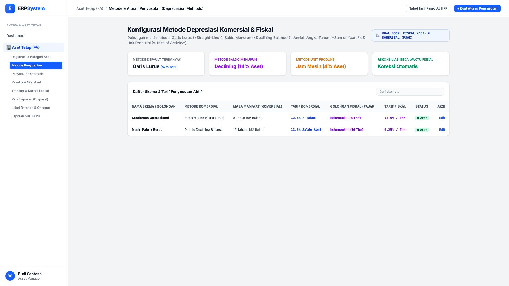
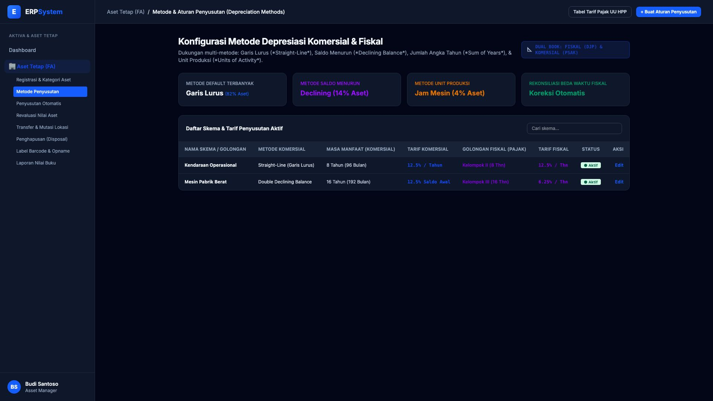

# 🎨 Design UI — Metode Penyusutan Aset (Depreciation Methods)

> Mockup antarmuka **Metode & Konfigurasi Depresiasi Aset (Depreciation Rules & Tax Alignment)**: konfigurasi metode depresiasi komersial (PSAK) vs fiskal (UU HPP / Dirjen Pajak), perlakuan metode Garis Lurus (*Straight-Line*), Saldo Menurun (*Double Declining*), Unit Produksi (*Units of Production*), dan rekonsiliasi beda waktu penyusutan pada modul `FA` (Aset Tetap / Fixed Assets) dalam ERP System.

---

## Light Mode

---

## Dark Mode

---

## 📐 Komponen & Fitur Utama

1. **Header & Aturan Depresiasi**:
   - Status: 📐 **DUAL BOOK: FISKAL (DJP) & KOMERSIAL (PSAK)**.
   - Tombol **"Tabel Tarif Pajak UU HPP"**: Panduan golongan harta berwujud Bukan Bangunan I-IV & Bangunan.
   - Tombol **"+ Buat Aturan Penyusutan"** (*Primary Blue*): Penambahan skema depresiasi kustom.

2. **Ringkasan Pemanfaatan Metode (Stats Cards)**:
   - **Metode Default Terbanyak**: Garis Lurus (82% Populasi Aset)
   - **Metode Saldo Menurun**: Declining Balance (14% Aset)
   - **Metode Unit Produksi / Jam Mesin**: Units of Activity (4% Aset)
   - **Rekonsiliasi Beda Waktu Fiskal**: Koreksi Fiskal Positif/Negatif Otomatis

3. **Tabel Skema & Tarif Depresiasi**:
   - Menampilkan: *Nama Skema, Metode Komersial, Masa Manfaat, Tarif Komersial, Golongan Fiskal, Tarif Fiskal Pajak, dan Status*.
