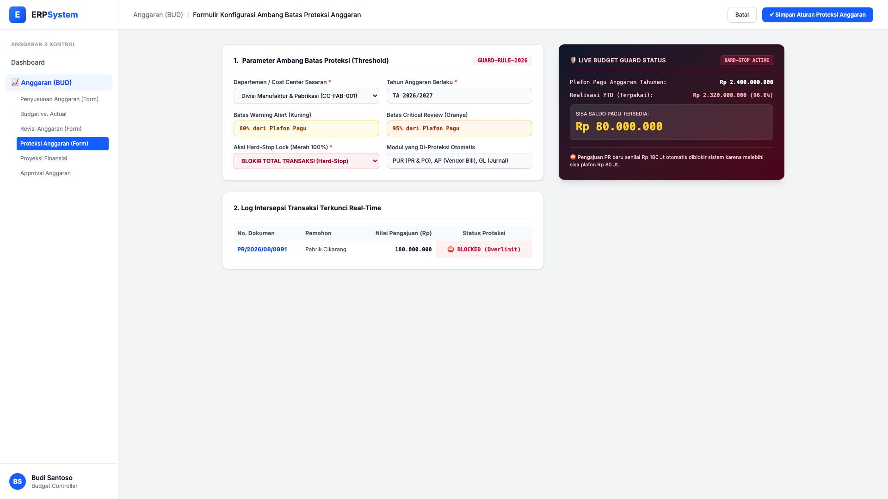
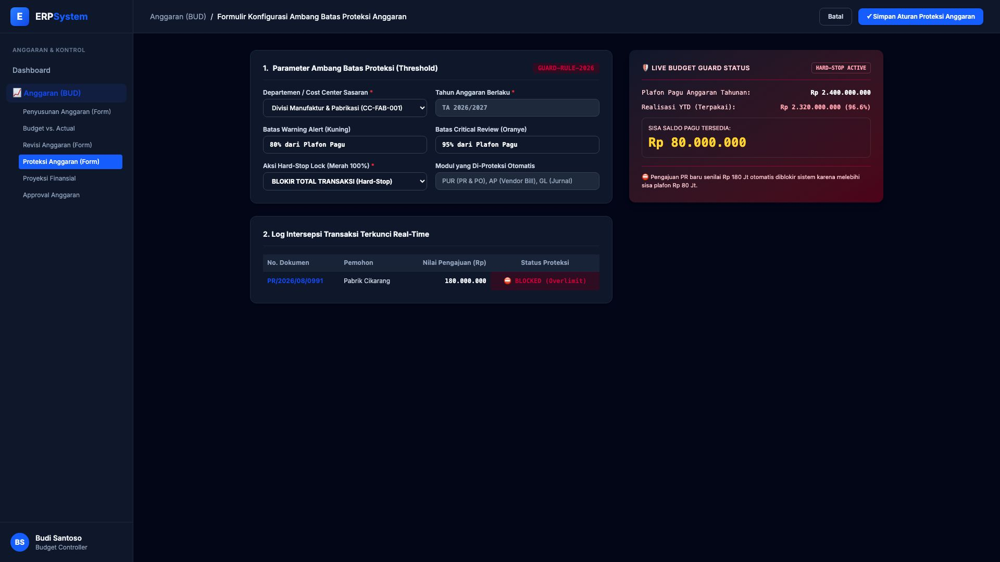

# 🎨 Design UI — Formulir Konfigurasi Proteksi Anggaran & Hard-Stop (Data Entry Screen)

> Mockup antarmuka **Formulir Konfigurasi Ambang Batas Proteksi Anggaran & Overbudget Hard-Stop (Budget Alert & Guard Configuration Data Entry)**: desain *Split-Screen Form* dengan formulir input proteksi di sebelah kiri (Departemen Divisi Fabrikasi CC-FAB-001, ambang peringatan kuning 80%, kritis 95%, aksi Hard-Stop lock 100% blokir transaksi PUR/AP/GL) dan *Live Status Proteksi Pagu Anggaran (Plafon Rp 2,4 M, Terpakai Rp 2,32 M, Sisa Rp 80 Jt) & Log Intersepsi PR/2026/08/0991 Rp 180 Jt Terblokir Otomatis* di sebelah kanan pada modul `BUD` (Anggaran / Budgeting) dalam ERP System.

---

## Light Mode

---

## Dark Mode

---

## 📝 Komponen & Fitur Formulir Input

1. **Panel Kiri — Formulir Parameter Aturan Proteksi Anggaran**:
   - Cost Center Sasaran: `Divisi Manufaktur & Pabrikasi (CC-FAB-001)`.
   - Level Peringatan: **Warning Alert (80%)** &bull; **Critical Notice (95%)**.
   - Aksi Batas Maksimum: **BLOKIR TOTAL TRANSAKSI (Hard-Stop Lock 100%)**.
   - Cakupan Modul: Otomatis melindungi modul `PUR` (PR/PO), `AP` (Tagihan Vendor), dan `GL` (Posting Jurnal).

2. **Panel Kanan — Live Guard Status & Intersepsi Real-Time**:
   - Plafon Anggaran Tahunan: **Rp 2.400.000.000** &bull; Realisasi YTD: **Rp 2.320.000.000 (96.6%)**.
   - Sisa Pagu Tersedia: **Rp 80.000.000**.
   - Intersepsi Otomatis: Pengajuan `PR/2026/08/0991` senilai Rp 180.000.000 langsung diblokir sistem (*Blocked Overlimit*).
