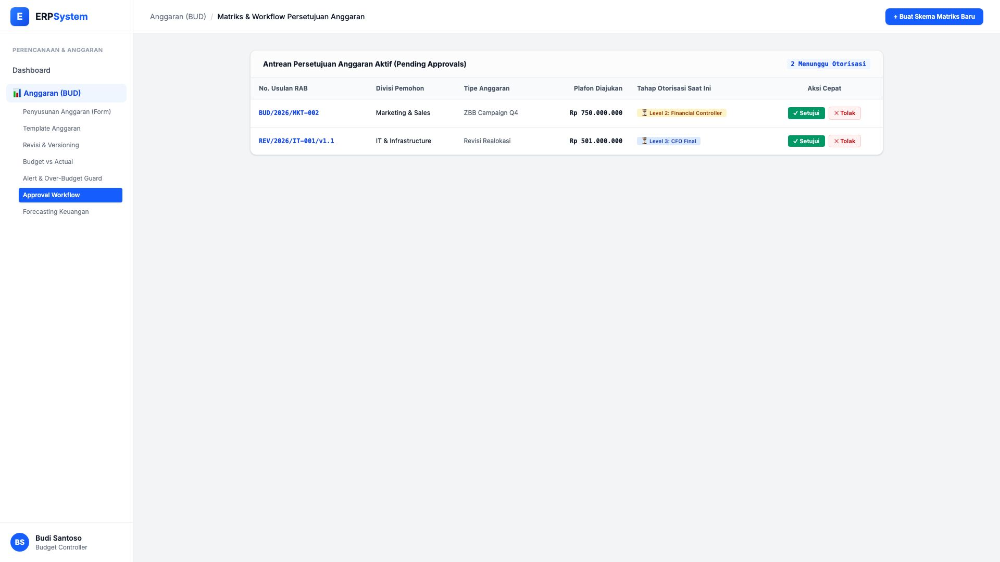
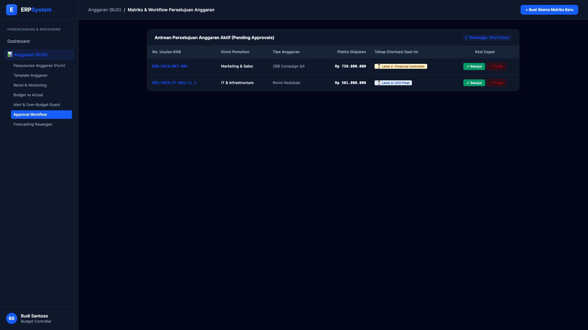

# 🎨 Design UI — Approval Workflow Anggaran (Budget Approval Workflow)

> Mockup antarmuka **Workflow & Matriks Otorisasi Persetujuan Anggaran (Budget Approval Workflow & Delegation Matrix)**: tata kelola persetujuan usulan RAB dan addendum revisi berjenjang (*Level 1 Head of Division, Level 2 Financial Controller, Level 3 CFO*) pada modul `BUD` (Anggaran / Budgeting) dalam ERP System.

---

## Light Mode

---

## Dark Mode

---

## 📝 Komponen & Fitur Utama

1. **Antrean Usulan Anggaran (Pending Approval Queue)**:
   - RAB Marketing Q4 (Rp 750 Jt): Menunggu Otorisasi Level 2 (*Financial Controller*).
   - Addendum IT v1.1 (Rp 501 Jt): Menunggu Otorisasi Level 3 (*Chief Financial Officer*).

2. **Aksi Cepat Otorisasi**:
   - Tombol **"✓ Setujui (Approve)"** & **"✕ Tolak (Reject dengan Catatan)"** untuk percepatan siklus persetujuan dokumen anggaran.
