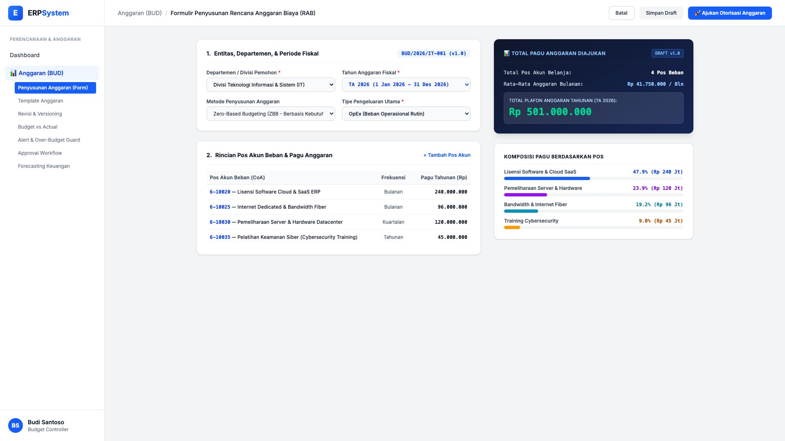
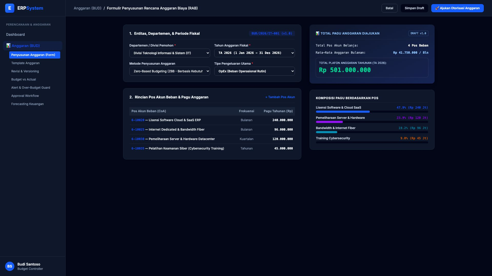

# 🎨 Design UI — Formulir Penyusunan Rencana Anggaran Biaya / RAB (Data Entry Screen)

> Mockup antarmuka **Formulir Penyusunan Rencana Anggaran Biaya (Budget Planning & Departmental RAB Entry)**: desain *Split-Screen Form* dengan formulir penyusunan pagu di sebelah kiri (Pemilihan entitas departemen IT/Marketing, Tahun Fiskal 2026, metode Zero-Based Budgeting ZBB, rincian pos akun belanja CoA, frekuensi pembayaran) dan *Live Ringkasan Plafon Anggaran serta Komposisi Pagu Berdasarkan Pos Beban* di sebelah kanan pada modul `BUD` (Anggaran / Budgeting) dalam ERP System.

---

## Light Mode

---

## Dark Mode

---

## 📝 Komponen & Fitur Formulir Input

1. **Panel Kiri — Formulir Pengusulan Anggaran**:
   - Nomor Referensi RAB: `BUD/2026/IT-001 (v1.0)`.
   - Divisi Pemohon: *Divisi Teknologi Informasi & Sistem (IT)*.
   - Tahun Anggaran: *TA 2026 (1 Jan 2026 - 31 Des 2026)*.
   - Metode Penyusunan: *Zero-Based Budgeting (ZBB - Berbasis Kebutuhan Riil)*.
   - Rincian Pos Akun Belanja (Lisensi SaaS Rp 240 Jt, Server Datacenter Rp 120 Jt, Dedicated Bandwidth Rp 96 Jt, Pelatihan Cybersecurity Rp 45 Jt).

2. **Panel Kanan — Ringkasan Plafon & Komposisi Anggaran**:
   - Total Plafon Anggaran Tahunan: **Rp 501.000.000** (Rata-rata Rp 41,75 Jt / Bulan).
   - Visualisasi Breakdown Pos Belanja: Lisensi SaaS (47.9%), Server Hardware (23.9%), Bandwidth (19.2%), Training (9.0%).
