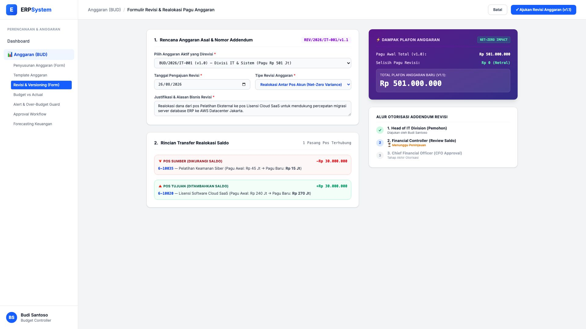
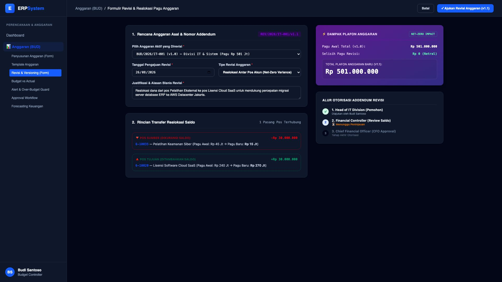

# 🎨 Design UI — Formulir Revisi & Realokasi Anggaran (Data Entry Screen)

> Mockup antarmuka **Formulir Revisi, Addendum, & Realokasi Pagu Anggaran (Budget Revision & Re-allocation Entry)**: desain *Split-Screen Form* dengan formulir input transfer pagu di sebelah kiri (Pilih anggaran aktif v1.0, justifikasi bisnis, pos sumber yang dikurangi vs pos tujuan yang ditambah) dan *Live Ringkasan Dampak Plafon Anggaran Net-Zero Impact serta Alur Otorisasi Multi-Tier Stepper* di sebelah kanan pada modul `BUD` (Anggaran / Budgeting) dalam ERP System.

---

## Light Mode

---

## Dark Mode

---

## 📝 Komponen & Fitur Formulir Input

1. **Panel Kiri — Formulir Pengajuan Revisi (Addendum)**:
   - Nomor Addendum Otomatis: `REV/2026/IT-001/v1.1`.
   - Anggaran Asal: `BUD/2026/IT-001 (v1.0)` (Divisi IT & Sistem).
   - Tipe Revisi: *Realokasi Antar Pos Akun (Net-Zero Variance)*.
   - Justifikasi: *Realokasi dana dari Pelatihan ke Lisensi Cloud SaaS untuk migrasi server AWS*.
   - Pasangan Transfer Saldo:
     - 🔻 Dikurangi: `6-10035 — Pelatihan Keamanan Siber` (-Rp 30.000.000, Pagu baru: Rp 15 Jt)
     - 🔺 Ditambah: `6-10020 — Lisensi Software Cloud SaaS` (+Rp 30.000.000, Pagu baru: Rp 270 Jt)

2. **Panel Kanan — Dampak Plafon & Stepper Otorisasi**:
   - Status Plafon: 🟢 **NET-ZERO IMPACT** (Pagu Total tetap Rp 501.000.000).
   - Stepper Otorisasi 3-Level: *Head of Division (Diajukan) &rarr; Financial Controller (Review Saldo) &rarr; CFO (Final Approval)*.
