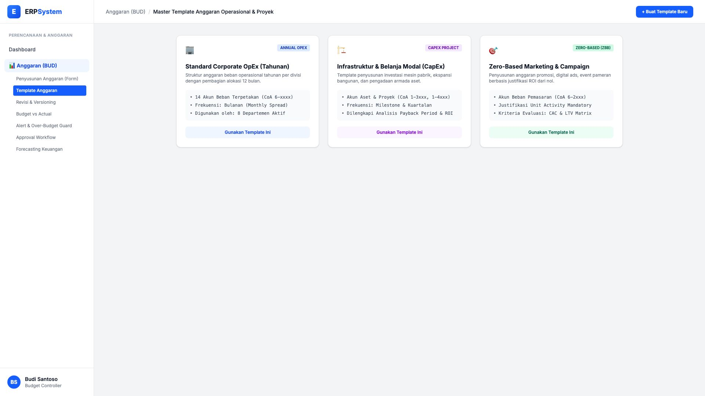
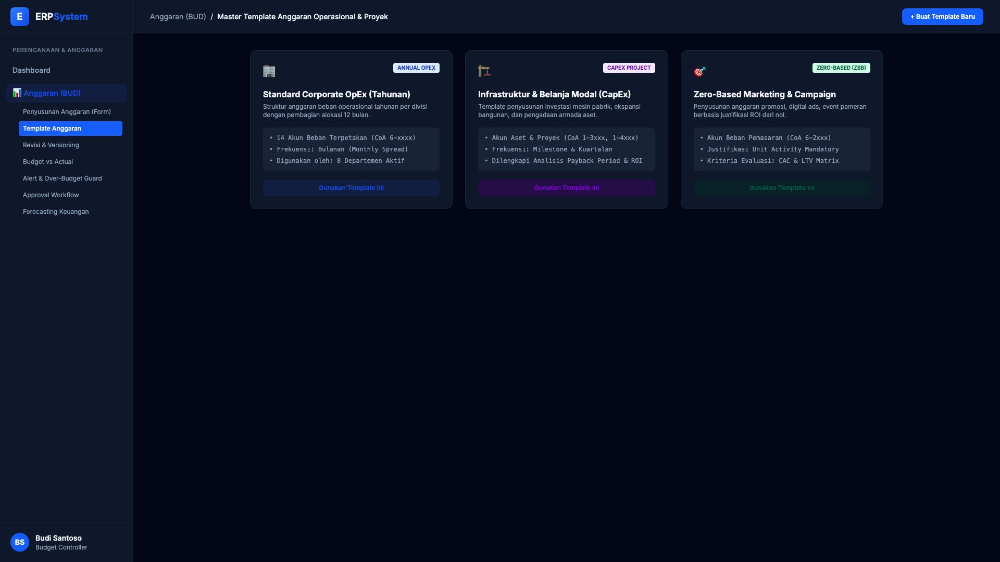

# 🎨 Design UI — Master Template Anggaran (Budget Templates)

> Mockup antarmuka **Master Template Anggaran Operasional & Proyek (Budget Templates Library)**: pustaka template standar penyusunan anggaran (*Annual Corporate OpEx, CapEx Infrastructure Project, Zero-Based Marketing Campaign*) untuk standarisasi alokasi pos akun beban pada modul `BUD` (Anggaran / Budgeting) dalam ERP System.

---

## Light Mode

---

## Dark Mode

---

## 📝 Komponen & Fitur Utama

1. **Standard Corporate OpEx (Tahunan)**:
   - Template anggaran beban operasional tahunan per divisi dengan distribusi 12 bulan (*Monthly Spread*).
   - Pemetaan otomatis 14 akun beban pokok (CoA 6-xxxx).

2. **Infrastruktur & Belanja Modal (CapEx Project)**:
   - Template belanja modal aset mesin pabrik, ekspansi bangunan, dan pengadaan armada.
   - Evaluasi kelayakan investasi (Payback Period, ROI, dan Milestone Kuartalan).

3. **Zero-Based Marketing & Campaign (ZBB)**:
   - Penyusunan anggaran promosi, digital ads, event pameran berbasis justifikasi ROI dari nol.
