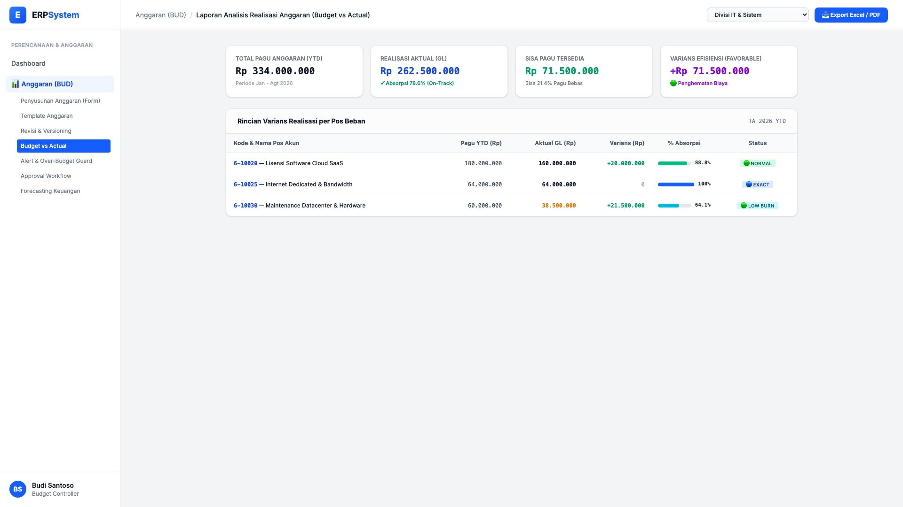
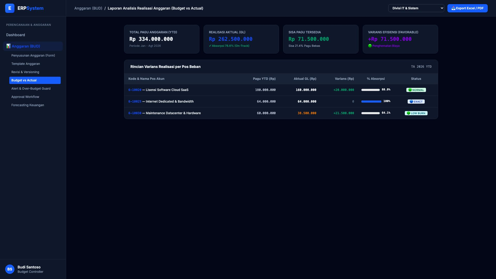

# 🎨 Design UI — Laporan Realisasi Anggaran (Budget vs Actual)

> Mockup antarmuka **Laporan Realisasi & Analisis Varians Anggaran (Budget vs Actual Performance Report)**: pemantauan serapan pagu anggaran tahun berjalan (*YTD Absorption Rate*), analisis varians penghematan (*Favorable vs Unfavorable Variance*), dan rincian per pos akun belanja pada modul `BUD` (Anggaran / Budgeting) dalam ERP System.

---

## Light Mode

---

## Dark Mode

---

## 📝 Komponen & Fitur Utama

1. **Ringkasan Serapan Pagu Fiskal (Stats Cards)**:
   - **Total Pagu Anggaran YTD**: Rp 334.000.000
   - **Realisasi Aktual (Buku Besar GL)**: Rp 262.500.000 (Serapan 78.6% — *On-Track*)
   - **Sisa Pagu Bebas Tersedia**: Rp 71.500.000 (21.4%)
   - **Varians Efisiensi (Favorable)**: +Rp 71.500.000 (Penghematan operasional)

2. **Tabel Rincian Varians Pos Belanja**:
   - Lisensi Software Cloud SaaS: Pagu Rp 180 Jt, Aktual Rp 160 Jt, Serapan 88.8% (Normal).
   - Dedicated Bandwidth: Pagu Rp 64 Jt, Aktual Rp 64 Jt, Serapan 100% (Exact).
   - Maintenance Datacenter: Pagu Rp 60 Jt, Aktual Rp 38,5 Jt, Serapan 64.1% (Low Burn).
