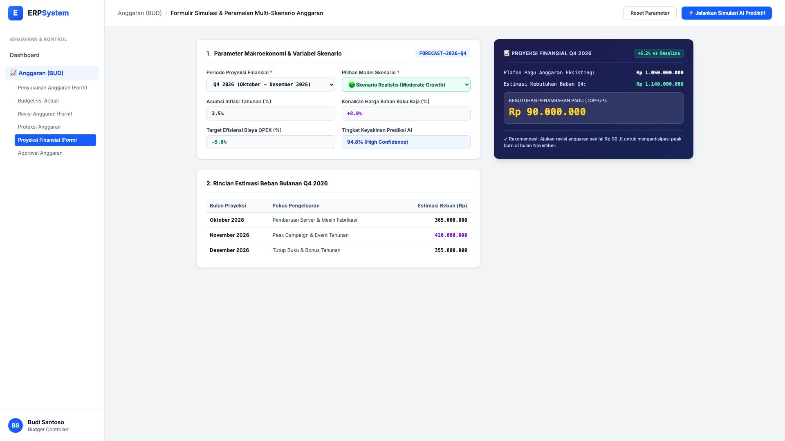
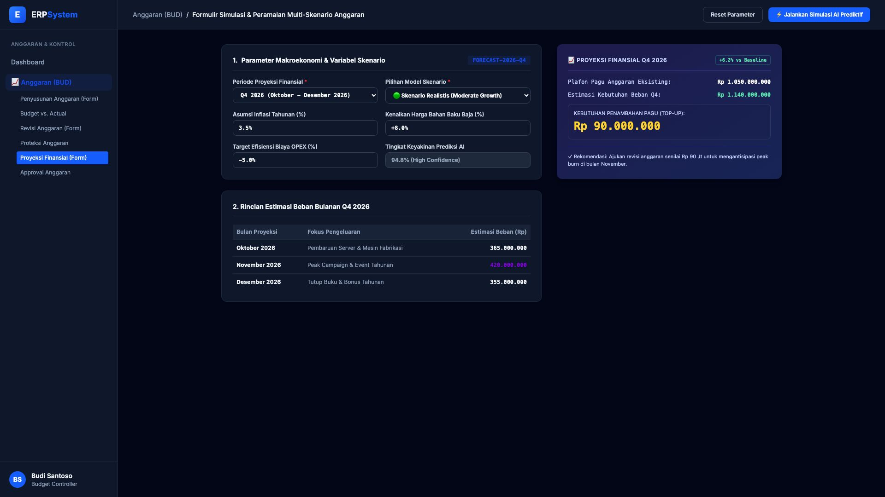

# 🎨 Design UI — Formulir Simulasi & Peramalan Skenario Anggaran (Data Entry Screen)

> Mockup antarmuka **Formulir Simulasi & Peramalan Finansial Multi-Skenario (Financial Forecasting & Scenario Modeling Data Entry)**: desain *Split-Screen Form* dengan formulir input simulasi di sebelah kiri (Periode Q4 2026, asumsi inflasi 3.5%, kenaikan harga baja +8.0%, target efisiensi OPEX -5.0%, pilihan model skenario Realistis/Konservatif/Agresif, tingkat keyakinan AI 94.8%) dan *Live Ringkasan Proyeksi Beban Q4 (Estimasi Kebutuhan Rp 1,14 M, Rekomendasi Top-Up Pagu Rp 90 Jt) & Timeline Pengeluaran Bulanan* di sebelah kanan pada modul `BUD` (Anggaran / Budgeting) dalam ERP System.

---

## Light Mode

---

## Dark Mode

---

## 📝 Komponen & Fitur Formulir Input

1. **Panel Kiri — Formulir Parameter Simulasi & AI Prediktif**:
   - Periode: `Q4 2026 (Oktober - Desember 2026)`.
   - Model Skenario: **🟢 Skenario Realistis (Moderate Growth)**.
   - Variabel Makro: Inflasi **3.5%** &bull; Kenaikan Harga Baja **+8.0%** &bull; Target Efisiensi **-5.0%**.
   - Model Confidence: **94.8% AI Predictive Accuracy**.

2. **Panel Kanan — Proyeksi Beban & Rekomendasi Pagu**:
   - Plafon Anggaran Eksisting: **Rp 1.050.000.000**.
   - Estimasi Kebutuhan Beban Q4: **Rp 1.140.000.000 (+6.2% vs Baseline)**.
   - **Rekomendasi Penambahan Pagu (Top-Up): Rp 90.000.000**.
