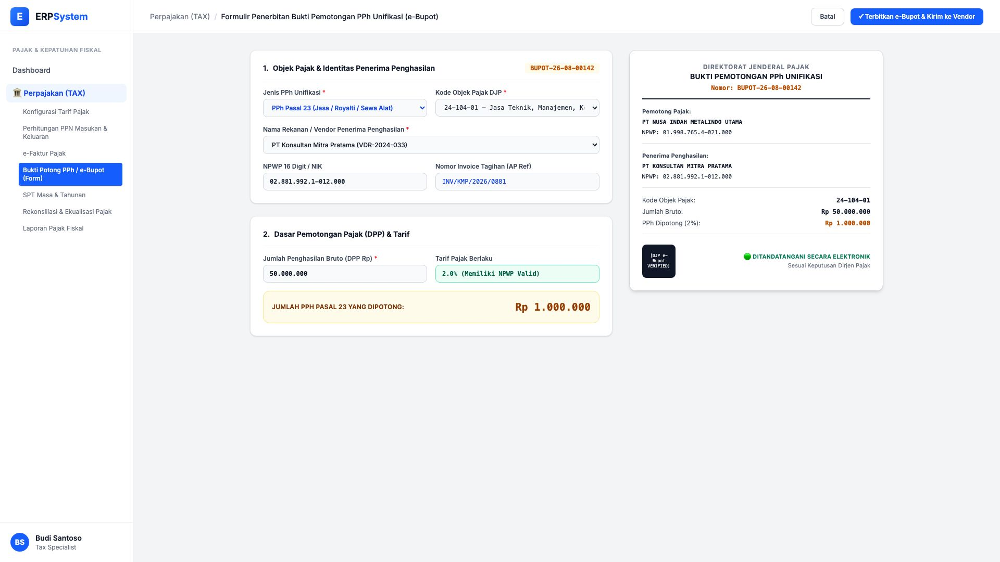
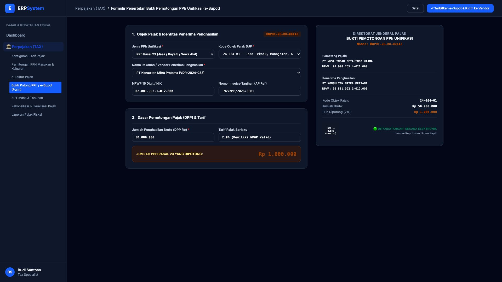

# 🎨 Design UI — Formulir Penerbitan Bukti Potong PPh / e-Bupot (Data Entry Screen)

> Mockup antarmuka **Formulir Pembuatan & Penerbitan Bukti Pemotongan PPh Unifikasi (e-Bupot PPh 23 / PPh 4(2))**: desain *Split-Screen Form* dengan formulir input pemotongan pajak di sebelah kiri (Pilihan PPh 23/PPh 4(2), Kode Objek Pajak 24-104-01 Jasa Konsultan, Rekanan Vendor NPWP, DPP Penghasilan Bruto Rp 50 Jt, Tarif 2%) dan *Live Pratinjau Lembar Bukti Pemotongan PPh Unifikasi Resmi DJP dengan Tanda Tangan Elektronik* di sebelah kanan pada modul `TAX` (Perpajakan) dalam ERP System.

---

## Light Mode

---

## Dark Mode

---

## 📝 Komponen & Fitur Formulir Input

1. **Panel Kiri — Formulir Perekaman e-Bupot**:
   - Nomor Bukti Potong Otomatis: `BUPOT-26-08-00142`.
   - Jenis Pajak: *PPh Pasal 23 (Jasa / Royalti / Sewa Alat)*.
   - Kode Objek Pajak: `24-104-01 — Jasa Teknik, Manajemen, Konsultan`.
   - Penerima Penghasilan: PT Konsultan Mitra Pratama (NPWP `02.881.992.1-012.000`).
   - DPP Penghasilan Bruto: Rp 50.000.000 &bull; Tarif 2.0% &bull; **PPh Dipotong: Rp 1.000.000**.

2. **Panel Kanan — Pratinjau Bukti Potong Resmi DJP**:
   - Format Dokumen Resmi Bupot Unifikasi DJP (Kemenkeu RI).
   - Validasi QR Code Digital Signature & Status Terverifikasi DJP Server.
