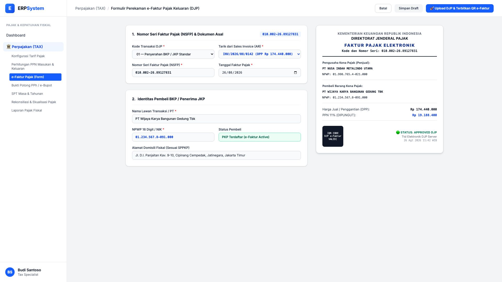
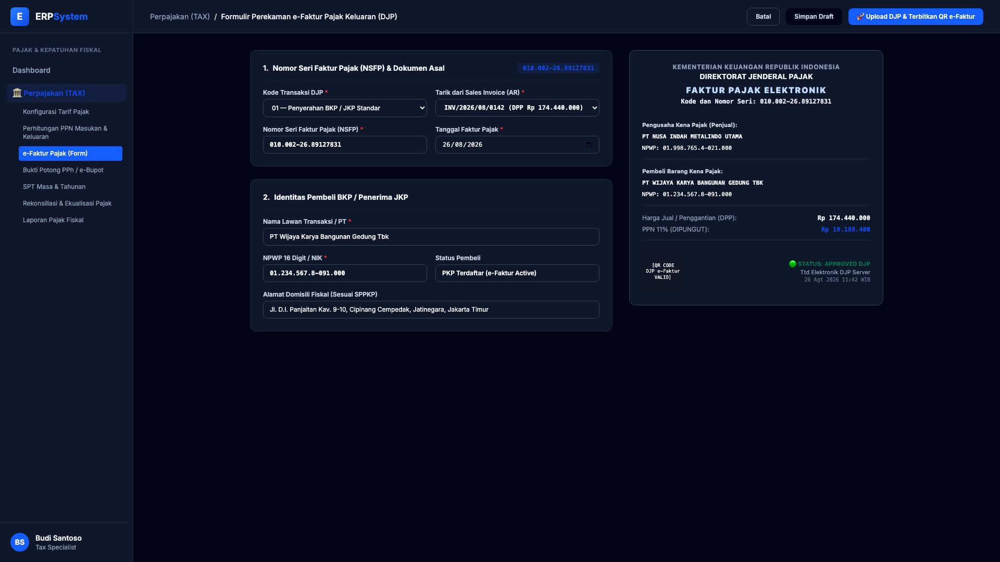

# 🎨 Design UI — Formulir Perekaman e-Faktur Pajak (Data Entry Screen)

> Mockup antarmuka **Formulir Perekaman & Penerbitan e-Faktur Pajak Keluaran (e-Faktur Processing & Generation)**: desain *Split-Screen Form* dengan formulir input faktur pajak di sebelah kiri (Kode Transaksi DJP 01, Penarikan Sales Invoice AR, NSFP 16 Digit, Identitas Pembeli BKP NPWP/NIK) dan *Live Pratinjau Lembar Faktur Pajak Elektronik Resmi DJP dengan QR Code Verifikasi* di sebelah kanan pada modul `TAX` (Perpajakan) dalam ERP System.

---

## Light Mode

---

## Dark Mode

---

## 📝 Komponen & Fitur Formulir Input

1. **Panel Kiri — Formulir Perekaman e-Faktur**:
   - Kode Transaksi DJP: `01 — Penyerahan BKP / JKP Standar`.
   - Referensi Faktur Penjualan: `INV/2026/08/0142 (DPP Rp 174.440.000)`.
   - Nomor Seri Faktur Pajak (NSFP): `010.002-26.89127831`.
   - Identitas Lawan Transaksi: PT Wijaya Karya Bangunan Gedung Tbk (NPWP `01.234.567.8-091.000`, Status: PKP Terdaftar).

2. **Panel Kanan — Pratinjau Format Dokumen Resmi DJP**:
   - Layout resmi Direktorat Jenderal Pajak (Kementerian Keuangan RI).
   - QR Code Validasi DJP Online & Tanda Tangan Elektronik Server DJP.
   - Status Validasi: 🟢 **APPROVED DJP**.
