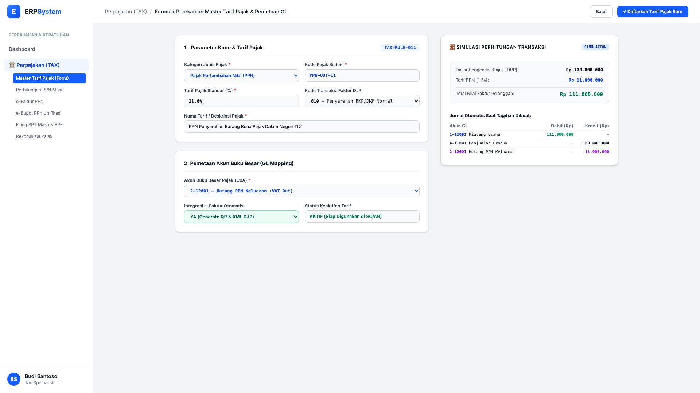
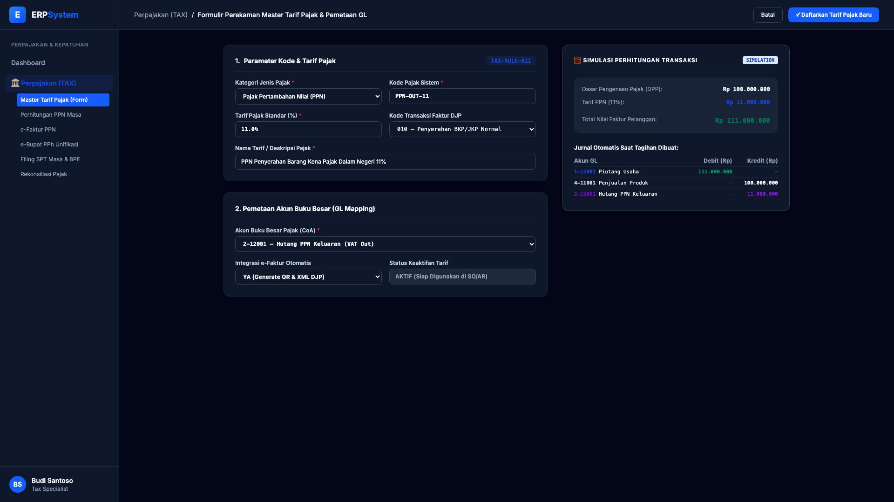

# 🎨 Design UI — Formulir Master Tarif Pajak & Pemetaan Akun (Data Entry Screen)

> Mockup antarmuka **Formulir Perekaman Master Tarif Pajak & Pemetaan Akun GL (Tax Rates & GL Mapping Data Entry)**: desain *Split-Screen Form* dengan formulir input tarif pajak di sebelah kiri (Kategori PPN, kode pajak `PPN-OUT-11`, tarif standar 11.0%, kode transaksi faktur 010 normal, pemetaan akun GL `2-12001 Hutang PPN Keluaran`, integrasi e-Faktur YA) dan *Live Simulasi Perhitungan Pajak Transaksi (DPP Rp 100 Jt + PPN 11% = Rp 111 Jt) & Pemetaan Jurnal Otomatis* di sebelah kanan pada modul `TAX` (Perpajakan) dalam ERP System.

---

## Light Mode

---

## Dark Mode

---

## 📝 Komponen & Fitur Formulir Input

1. **Panel Kiri — Formulir Parameter Tarif Pajak**:
   - Kategori: **Pajak Pertambahan Nilai (PPN)**.
   - Kode Pajak: `PPN-OUT-11` &bull; Tarif: **11.0% (Standar Nasional)**.
   - Kode Transaksi DJP: `010 — Penyerahan BKP/JKP Normal`.
   - Akun GL: `2-12001 — Hutang PPN Keluaran` &bull; Integrasi e-Faktur: **AKTIF**.

2. **Panel Kanan — Simulasi Perhitungan & Jurnal Otomatis**:
   - Simulasi: DPP Rp 100 Jt &rarr; PPN 11% Rp 11 Jt &rarr; Total Faktur Piutang: **Rp 111.000.000**.
   - Jurnal Otomatis: Debit `1-12001 Piutang Usaha` (Rp 111 Jt) vs Kredit `4-11001 Pendapatan Penjualan` (Rp 100 Jt) & Kredit `2-12001 Hutang PPN Keluaran` (Rp 11 Jt).
