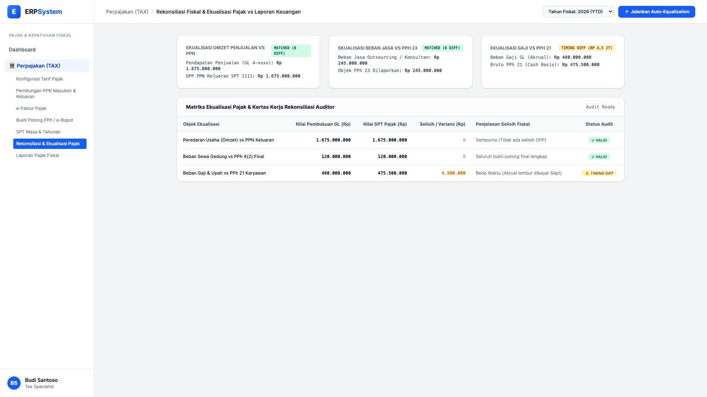
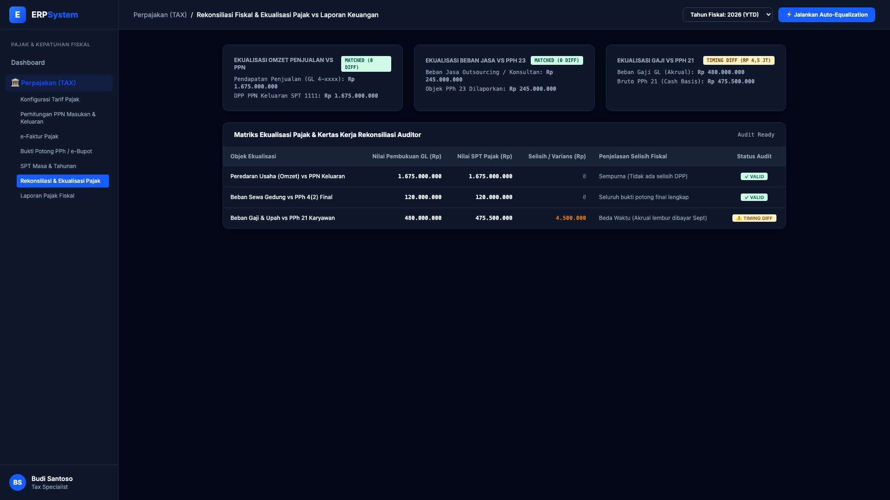

# 🎨 Design UI — Rekonsiliasi & Ekualisasi Pajak (Tax Equalization)

> Mockup antarmuka **Rekonsiliasi Fiskal & Ekualisasi Pajak vs Laporan Keuangan (Tax Equalization Matrix)**: pencocokan otomatis peredaran usaha vs DPP PPN Keluaran SPT 1111, ekualisasi beban jasa konsultan vs objek PPh 23, serta rekonsiliasi beda waktu beban gaji vs PPh 21 pada modul `TAX` (Perpajakan) dalam ERP System.

---

## Light Mode

---

## Dark Mode

---

## 📝 Komponen & Fitur Utama

1. **Ringkasan Ekualisasi Fiskal (Tahun Berjalan 2026 YTD)**:
   - **Omzet Penjualan vs PPN Keluaran**: Rp 1,675 Miliar vs Rp 1,675 Miliar (🟢 Matched 0 Selisih).
   - **Beban Jasa vs PPh 23**: Rp 245 Jt vs Rp 245 Jt (🟢 Matched 0 Selisih).
   - **Beban Gaji vs PPh 21**: Selisih Rp 4,5 Jt karena Beda Waktu (*Timing Difference akrual lembur*).

2. **Matriks Ekualisasi Pajak & Kertas Kerja Auditor**:
   - Analisis kesesuaian data akuntansi GL dengan laporan SPT untuk kesiapan menghadapi *Surat Permintaan Penjelasan atas Data dan/atau Keterangan (SP2DK)* dari Kantor Pelayanan Pajak (KPP).
