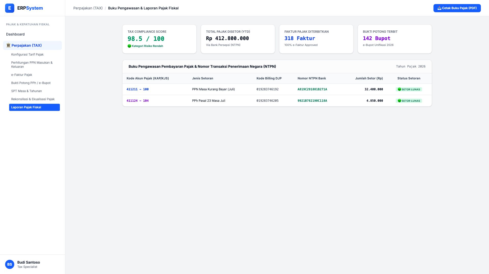
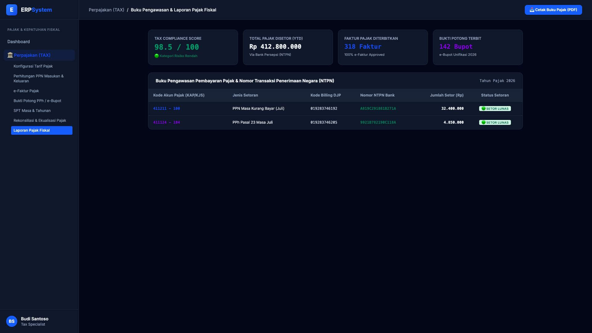

# 🎨 Design UI — Buku Pengawasan & Laporan Pajak Fiskal (Tax Reports)

> Mockup antarmuka **Buku Pengawasan Pembayaran Pajak & Laporan Kepatuhan Fiskal (Tax Compliance & NTPN Monitoring)**: pengawasan bukti setor NTPN bank persepsi, skor kepatuhan pajak (*Tax Compliance Score 98.5/100*), dan riwayat setoran per Kode Akun Pajak (KAP/KJS) pada modul `TAX` (Perpajakan) dalam ERP System.

---

## Light Mode

---

## Dark Mode

---

## 📝 Komponen & Fitur Utama

1. **Dashboard Kepatuhan Perpajakan (KPI Cards)**:
   - **Tax Compliance Score**: 98.5 / 100 (🟢 Kategori Risiko Rendah).
   - **Total Pajak Disetor (YTD 2026)**: Rp 412.800.000 (Melalui Bank Persepsi).
   - **Faktur Pajak Terbit**: 318 Faktur (100% DJP Approved).
   - **Bukti Potong Terbit**: 142 Bupot Unifikasi.

2. **Buku Pengawasan NTPN & Kode Billing**:
   - Pencatatan otomatis Nomor Transaksi Penerimaan Negara (NTPN) sebagai bukti setor sah negara.
