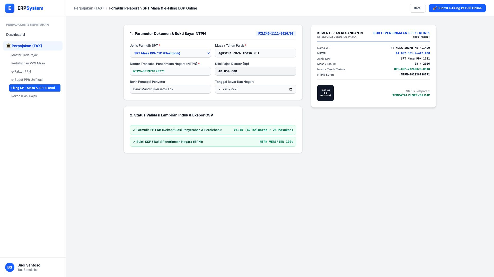
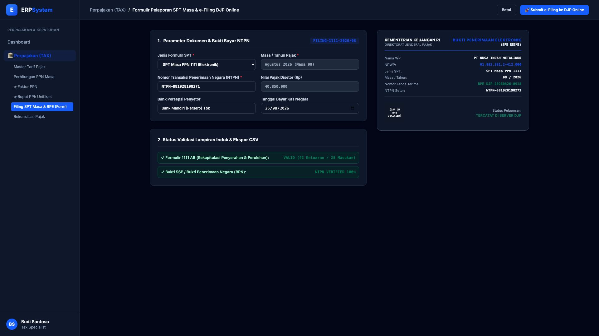

# 🎨 Design UI — Formulir Pelaporan SPT Masa & e-Filing DJP (Data Entry Screen)

> Mockup antarmuka **Formulir Pelaporan SPT Masa & e-Filing DJP Online (Tax Returns Filing Data Entry)**: desain *Split-Screen Form* dengan formulir input pelaporan SPT di sebelah kiri (SPT Masa PPN 1111, Masa Agustus 2026, nomor bukti setor NTPN Bank Mandiri `NTPN-881928198271`, nilai setor pajak Rp 40.850.000, validasi lampiran induk) dan *Live Pratinjau Dokumen Bukti Penerimaan Elektronik (BPE Resmi DJP Online) & QR Code Verifikasi Ditjen Pajak* di sebelah kanan pada modul `TAX` (Perpajakan) dalam ERP System.

---

## Light Mode

---

## Dark Mode

---

## 📝 Komponen & Fitur Formulir Input

1. **Panel Kiri — Formulir Parameter Pelaporan SPT & NTPN**:
   - Jenis Formulir: **SPT Masa PPN 1111 (Elektronik)** &bull; Masa Pajak: `Agustus 2026 (08)`.
   - Kode Setor NTPN: `NTPN-881928198271` &bull; Bank Persepsi: *Bank Mandiri*.
   - Nilai Pajak Disetor: **Rp 40.850.000** &bull; Validasi: **Lampiran 1111 AB Valid 100%**.

2. **Panel Kanan — Bukti Penerimaan Elektronik (BPE Resmi DJP)**:
   - Dokumen BPE Resmi Kementerian Keuangan RI / Ditjen Pajak.
   - Nomor Tanda Terima: `BPE-DJP-20260826-0918` &bull; QR Code terverifikasi di server resmi DJP.
