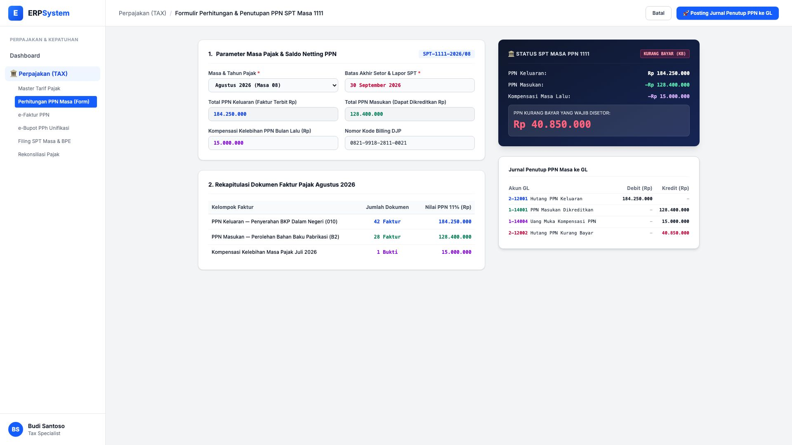
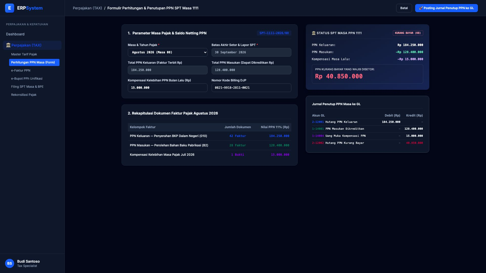

# 🎨 Design UI — Formulir Perhitungan & Penutupan PPN Masa 1111 (Data Entry Screen)

> Mockup antarmuka **Formulir Perhitungan, Kompensasi, & Penutupan PPN SPT Masa 1111 (VAT Settlement & Calculation Data Entry)**: desain *Split-Screen Form* dengan formulir input rekonsiliasi PPN di sebelah kiri (Masa Pajak Agustus 2026, batas setor 30 Sept, total PPN Keluaran Rp 184,25 Jt, total PPN Masukan Rp 128,4 Jt, kompensasi bulan lalu Rp 15 Jt, kode billing setor) dan *Live Ringkasan Status Induk SPT 1111 (Kurang Bayar KB Rp 40.850.000) & Jurnal Penutup PPN Otomatis ke GL* di sebelah kanan pada modul `TAX` (Perpajakan) dalam ERP System.

---

## Light Mode

---

## Dark Mode

---

## 📝 Komponen & Fitur Formulir Input

1. **Panel Kiri — Formulir Parameter PPN Masa & Billing**:
   - Masa Pajak: `Agustus 2026 (Masa 08)`.
   - PPN Keluaran (AR Faktur Terbit): **Rp 184.250.000 (42 Faktur)**.
   - PPN Masukan (AP Faktur Masukan): **Rp 128.400.000 (28 Faktur)**.
   - Kompensasi Masa Lalu: **Rp 15.000.000** &bull; Billing DJP: `0821-9918-2811-0021`.

2. **Panel Kanan — Induk SPT 1111 & Jurnal Penutup GL**:
   - Status SPT: **KURANG BAYAR (KB) — Rp 40.850.000**.
   - Jurnal Otomatis Penutup PPN: Debit `2-12001 Hutang PPN Keluaran` (Rp 184.250.000) vs Kredit `1-14001 PPN Masukan` (Rp 128.400.000), Kredit `1-14004 Kompensasi PPN` (Rp 15.000.000), dan Kredit `2-12002 Hutang PPN Kurang Bayar` (Rp 40.850.000).
