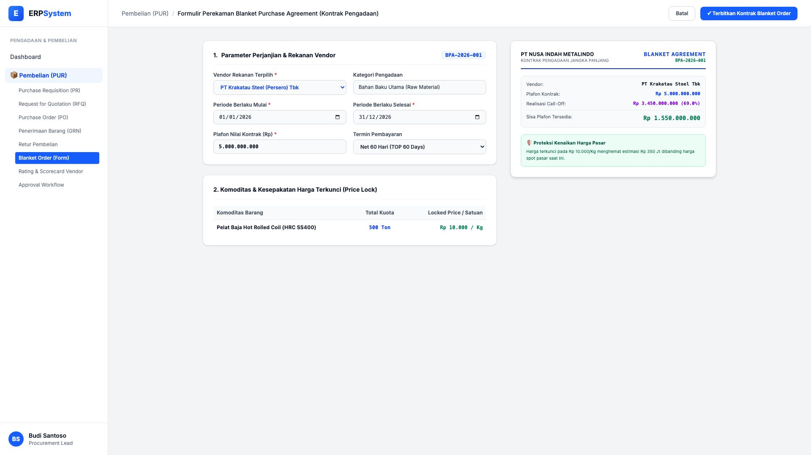
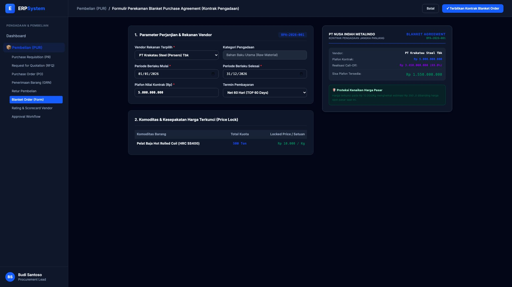

# 🎨 Design UI — Formulir Blanket Purchase Agreement (Data Entry Screen)

> Mockup antarmuka **Formulir Perekaman Kontrak Pengadaan & Blanket Order (Blanket Purchase Agreement Data Entry)**: desain *Split-Screen Form* dengan formulir input kontrak pengadaan di sebelah kiri (Vendor PT Krakatau Steel Tbk, periode kontrak 2026, plafon nilai Rp 5 Miliar, kuota volume 500 Ton baja, harga terkunci *Locked Price* Rp 10.000/Kg, termin TOP 60 hari) dan *Live Dokumen Perjanjian Payung (BPA-2026-001 Resmi) & Ringkasan Penyerapan Kuota Plafon (Realisasi Rp 3,45 M / 69%, Sisa Rp 1,55 M)* di sebelah kanan pada modul `PUR` (Pembelian / Purchasing) dalam ERP System.

---

## Light Mode

---

## Dark Mode

---

## 📝 Komponen & Fitur Formulir Input

1. **Panel Kiri — Formulir Parameter Kontrak Pengadaan**:
   - Vendor Rekanan: `PT Krakatau Steel (Persero) Tbk`.
   - Masa Berlaku: `01/01/2026 s/d 31/12/2026` &bull; Termin: **TOP 60 Hari**.
   - Plafon Anggaran Kontrak: **Rp 5.000.000.000**.
   - Komoditas Terkunci: **Pelat Baja Hot Rolled Coil (500 Ton @ Rp 10.000/Kg Locked Price)**.

2. **Panel Kanan — Dokumen Perjanjian & Tracking Kuota**:
   - Dokumen Blanket Purchase Agreement: `BPA-2026-001`.
   - Penyerapan Call-Off YTD: **Rp 3.450.000.000 (69.0%)**.
   - Sisa Plafon Tersedia: **Rp 1.550.000.000**.
   - Keuntungan Hedging: Penghematan harga pasar spot estimasi mencapai Rp 350 Juta.
