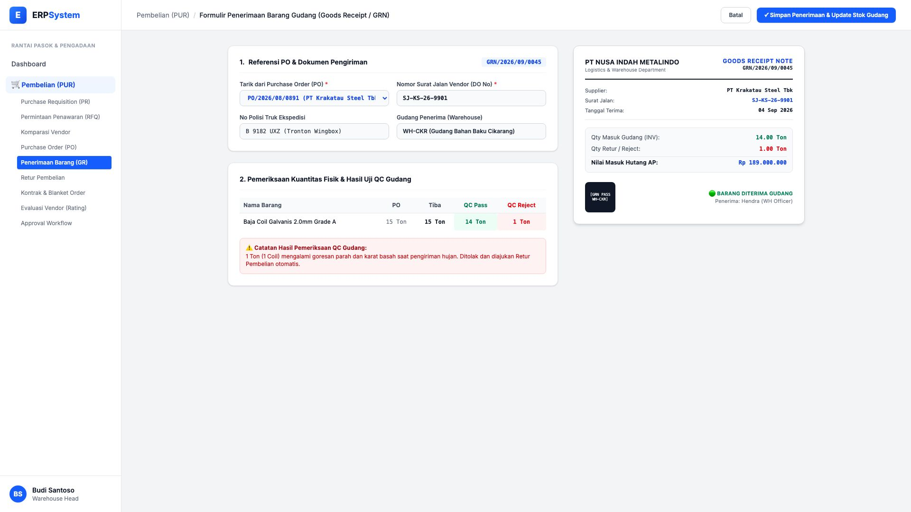
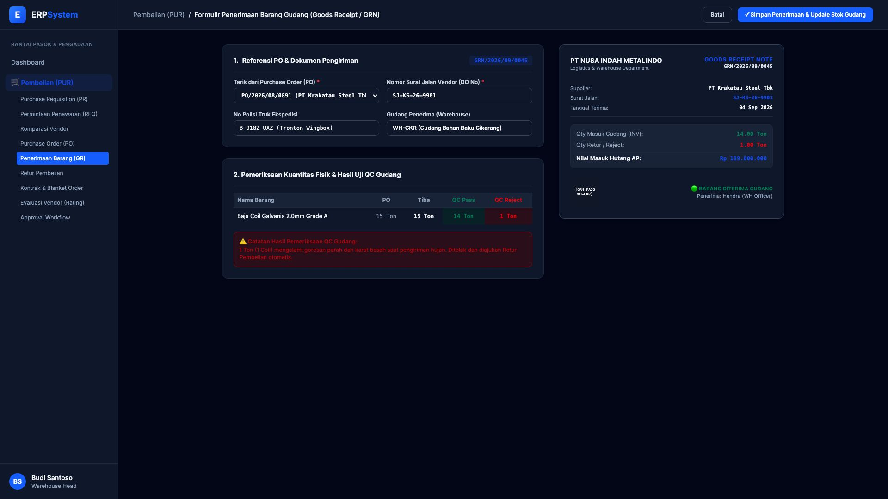

# 🎨 Design UI — Formulir Penerimaan Barang / GRN (Data Entry Screen)

> Mockup antarmuka **Formulir Penerimaan Barang Gudang & Uji Kualitas Fisik (Goods Receipt Note / GRN Data Entry)**: desain *Split-Screen Form* dengan formulir input penerimaan di sebelah kiri (Tarik PO Krakatau Steel, nomor surat jalan vendor SJ-KS-26-9901, nopol truk ekspedisi, kuantitas PO 15 Ton, kuantitas lolos QC 14 Ton, kuantitas reject rusak 1 Ton) dan *Live Pratinjau Lembar Bukti Penerimaan Barang (GRN Slip) & Integrasi Stok/Hutang* di sebelah kanan pada modul `PUR` (Pembelian / Purchasing) dalam ERP System.

---

## Light Mode

---

## Dark Mode

---

## 📝 Komponen & Fitur Formulir Input

1. **Panel Kiri — Formulir Perekaman Penerimaan Barang**:
   - Nomor GRN Otomatis: `GRN/2026/09/0045`.
   - Referensi PO: `PO/2026/08/0891 (PT Krakatau Steel Tbk)`.
   - Surat Jalan Vendor: `SJ-KS-26-9901` &bull; Truk: `B 9182 UXZ (Tronton Wingbox)`.
   - Hasil Uji QC: **14.0 Ton QC PASS (Masuk Stok)** &bull; **1.0 Ton QC REJECT (Karat/Gores & Ditolak)**.

2. **Panel Kanan — Integrasi Otomatis Antar-Modul**:
   - Update Stok Masuk Gudang ke Modul `INV`: +14.00 Ton Baja Coil.
   - Tagihan Akrual AP ke Modul `AP`: Rp 189.000.000 (Hanya ditagihkan sesuai barang lolos QC).
   - Trigger otomatis ke modul Retur Pembelian untuk 1 Ton reject.
