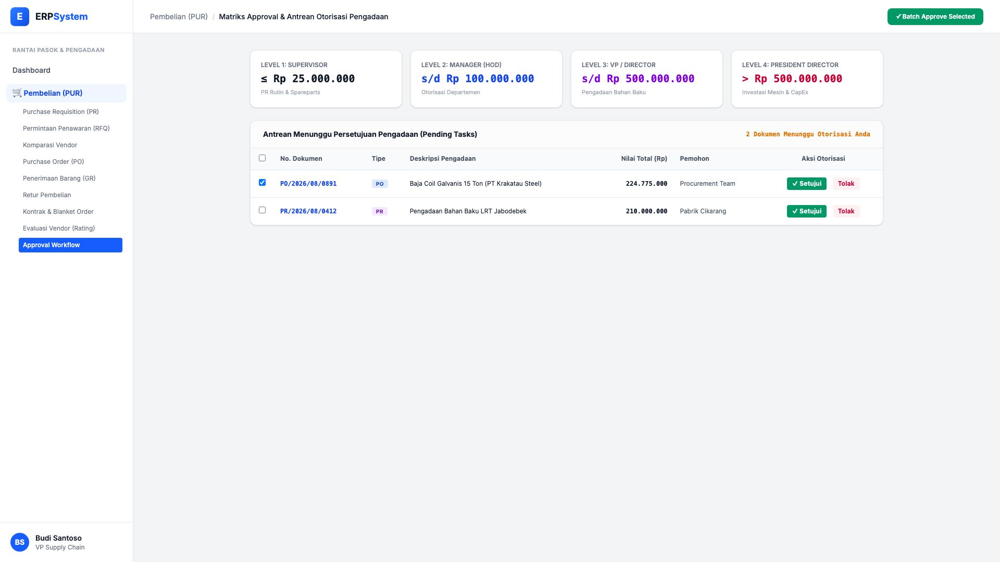
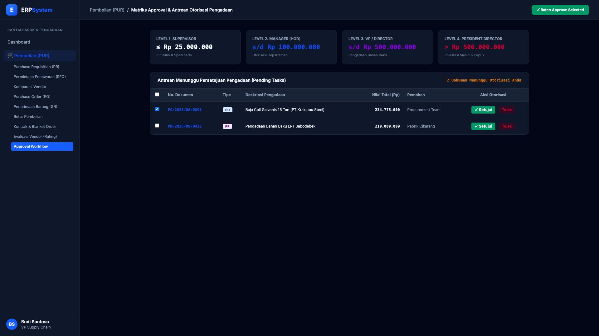

# 🎨 Design UI — Approval Workflow Pembelian (Procurement Approvals)

> Mockup antarmuka **Matriks Persetujuan & Antrean Otorisasi Pembelian Bertingkat (Purchasing Approval Workflow & DoA Matrix)**: batas wewenang otorisasi (Supervisor &le; Rp 25 Jt, Manager &le; Rp 100 Jt, VP/Director &le; Rp 500 Jt, President Director &gt; Rp 500 Jt), antrean persetujuan PR/PO, dan eksekusi persetujuan multi-dokumen (Batch Approval) pada modul `PUR` (Pembelian / Purchasing) dalam ERP System.

---

## Light Mode

---

## Dark Mode

---

## 📝 Komponen & Fitur Utama

1. **Matriks Batas Wewenang Otorisasi (Delegation of Authority - DoA)**:
   - **Level 1 (Supervisor)**: &le; Rp 25.000.000 (PR Rutin Pabrik).
   - **Level 2 (Department Manager)**: &le; Rp 100.000.000 (Otorisasi Departemen).
   - **Level 3 (VP Supply Chain / Finance Director)**: &le; Rp 500.000.000 (Bahan Baku Utama).
   - **Level 4 (President Director)**: &gt; Rp 500.000.000 (Investasi Mesin & CapEx).

2. **Antrean Dokumen Menunggu Persetujuan**:
   - `PO/2026/08/0891` — Baja Coil 15 Ton Krakatau Steel (Rp 224.775.000).
   - `PR/2026/08/0412` — Permintaan Bahan Baku LRT (Rp 210.000.000).
