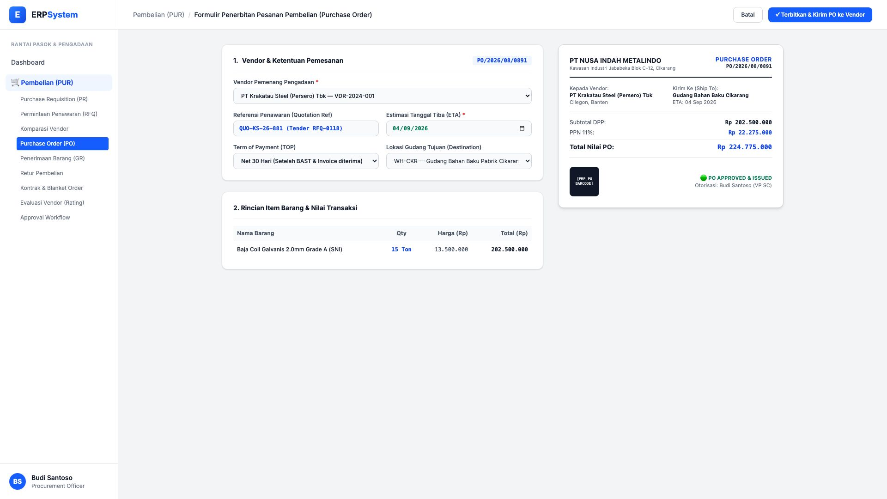
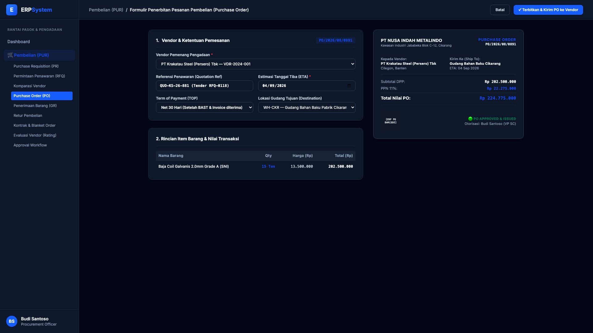

# 🎨 Design UI — Formulir Penerbitan Purchase Order / PO (Data Entry Screen)

> Mockup antarmuka **Formulir Pembuatan & Penerbitan Surat Pesanan Pembelian (Purchase Order / PO Data Entry)**: desain *Split-Screen Form* dengan formulir input PO di sebelah kiri (Vendor PT Krakatau Steel, referensi hasil tender RFQ, ETA 4 Sept 2026, TOP Net 30, rincian plat baja coil 15 Ton @ Rp 13,5 Jt) dan *Live Pratinjau Lembar Surat Pesanan Resmi PO Lengkap dengan Barcode Tracking & Otorisasi* di sebelah kanan pada modul `PUR` (Pembelian / Purchasing) dalam ERP System.

---

## Light Mode

---

## Dark Mode

---

## 📝 Komponen & Fitur Formulir Input

1. **Panel Kiri — Formulir Perekaman Purchase Order**:
   - Nomor PO Otomatis: `PO/2026/08/0891`.
   - Rekanan Vendor: *PT Krakatau Steel (Persero) Tbk (VDR-2024-001)*.
   - Referensi Penawaran: `QUO-KS-26-881 (Tender RFQ-0118)`.
   - Estimasi Tanggal Tiba (ETA): *04 September 2026*.
   - Rincian Transaksi: Subtotal DPP Rp 202.500.000 + PPN 11% Rp 22.275.000 = **Total PO Rp 224.775.000**.

2. **Panel Kanan — Pratinjau Dokumen PO Resmi**:
   - Format standar legal PT Nusa Indah Metalindo dengan Barcode Serial Tracking.
   - Status Otorisasi: 🟢 **PO APPROVED & ISSUED**.
