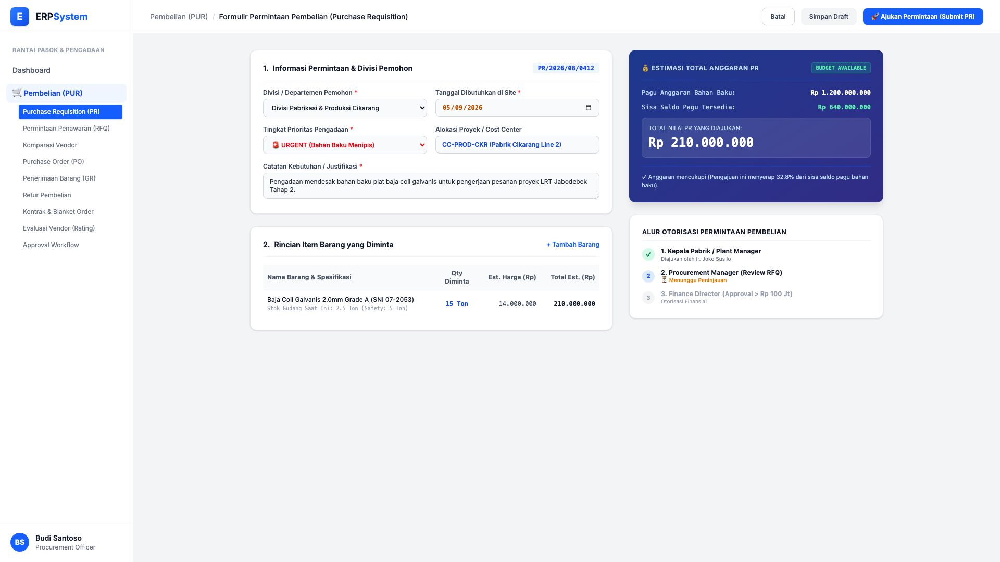
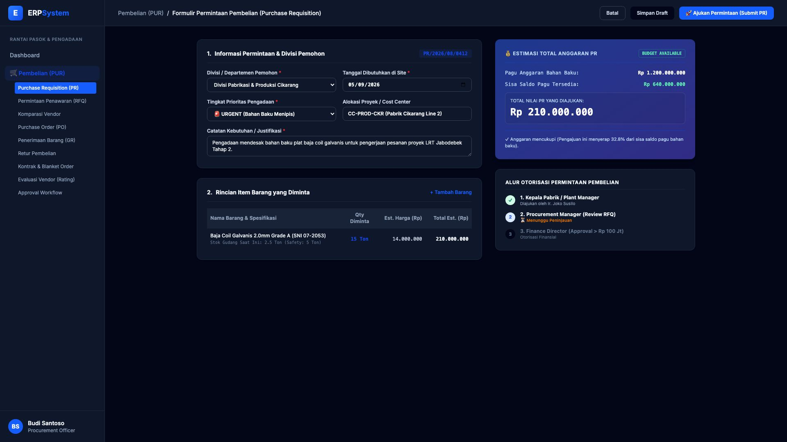

# 🎨 Design UI — Formulir Permintaan Pembelian / PR (Data Entry Screen)

> Mockup antarmuka **Formulir Pengajuan Permintaan Pembelian Internal (Purchase Requisition Data Entry)**: desain *Split-Screen Form* dengan formulir input kebutuhan pengadaan di sebelah kiri (Divisi pemohon pabrikasi, tanggal target tiba, prioritas URGENT, pos cost center, line items plat baja coil 15 Ton) dan *Validasi Saldo Anggaran Otomatis (Budget Guard) & Alur Otorisasi Multi-Level* di sebelah kanan pada modul `PUR` (Pembelian / Purchasing) dalam ERP System.

---

## Light Mode

---

## Dark Mode

---

## 📝 Komponen & Fitur Formulir Input

1. **Panel Kiri — Formulir Pengajuan PR**:
   - Nomor PR Otomatis: `PR/2026/08/0412`.
   - Divisi Pemohon: *Divisi Pabrikasi & Produksi Cikarang*.
   - Target Dibutuhkan: *5 September 2026 (🚨 URGENT - Menipis)*.
   - Line Item Barang: Plat Baja Coil Galvanis 2.0mm Grade A (Qty 15 Ton @ Rp 14 Jt = Rp 210.000.000).

2. **Panel Kanan — Proteksi Anggaran & Stepper Otorisasi**:
   - **Pengecekan Saldo Pagu (BUD Guard)**: Sisa saldo bahan baku Rp 640 Jt &bull; Permintaan PR Rp 210 Jt &bull; Status: 🟢 **BUDGET AVAILABLE (32.8% Terpakai)**.
   - Stepper Otorisasi: *Plant Manager (Diajukan) &rarr; Procurement Manager (Review RFQ) &rarr; Finance Director (Approval Final)*.
