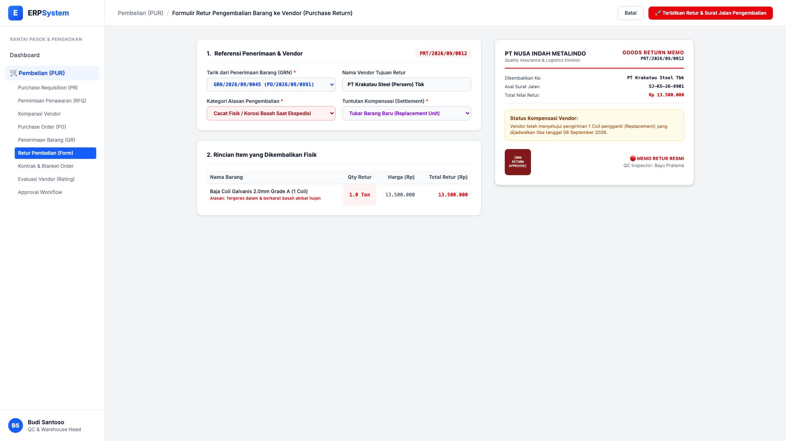
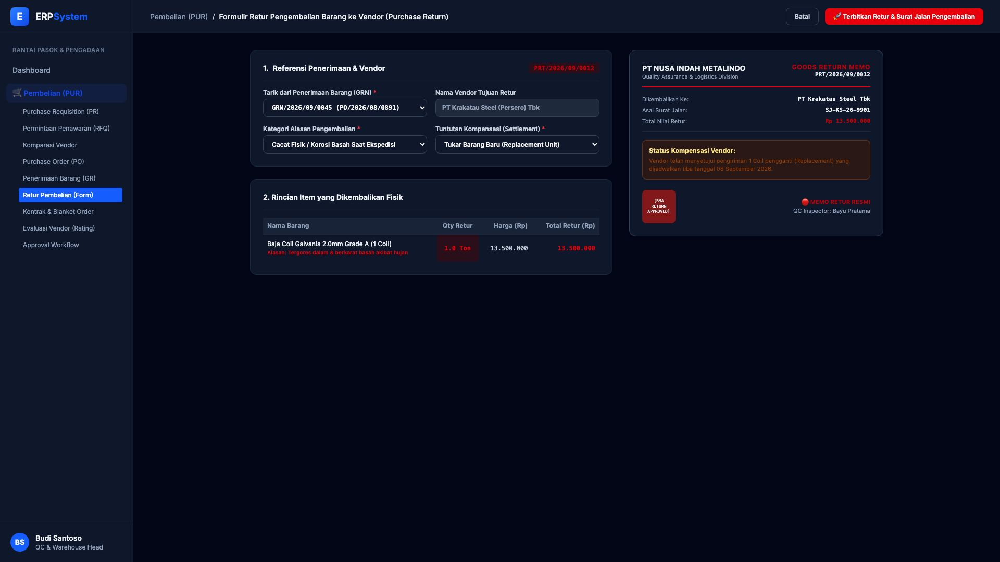

# 🎨 Design UI — Formulir Retur Pembelian / Purchase Return (Data Entry Screen)

> Mockup antarmuka **Formulir Pengembalian Barang Rusak/Cacat ke Rekanan Vendor (Purchase Return & RMA Processing)**: desain *Split-Screen Form* dengan formulir input retur di sebelah kiri (Tarik GRN penerimaan gudang, vendor tujuan PT Krakatau Steel, alasan cacat basah berkarat saat pengiriman hujan, pilihan kompensasi: Replacement barang baru, rincian 1 Ton coil ditolak) dan *Live Pratinjau Lembar Goods Return Memo Resmi & Status Tracking Penggantian Barang* di sebelah kanan pada modul `PUR` (Pembelian / Purchasing) dalam ERP System.

---

## Light Mode

---

## Dark Mode

---

## 📝 Komponen & Fitur Formulir Input

1. **Panel Kiri — Formulir Perekaman Retur**:
   - Nomor Retur Otomatis: `PRT/2026/09/0012`.
   - Asal Penerimaan: `GRN/2026/09/0045 (PO/2026/08/0891)`.
   - Vendor Tujuan: PT Krakatau Steel (Persero) Tbk.
   - Alasan Retur: *Cacat Fisik / Korosi Basah Saat Ekspedisi Hujan*.
   - Rincian: 1.0 Ton Coil Galvanis @ Rp 13.500.000 (Total Retur: Rp 13.500.000).

2. **Panel Kanan — Pratinjau Dokumen Return Memo Resmi**:
   - Format Dokumen Resmi Goods Return Memo Divisi QA & Logistik.
   - Status Tracking Kompensasi: 🟡 **Replacement Unit Disetujui Vendor** (Tiba estimasi 08 September 2026).
