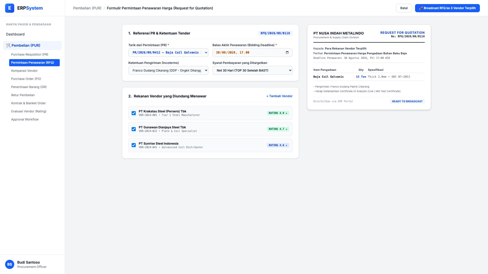
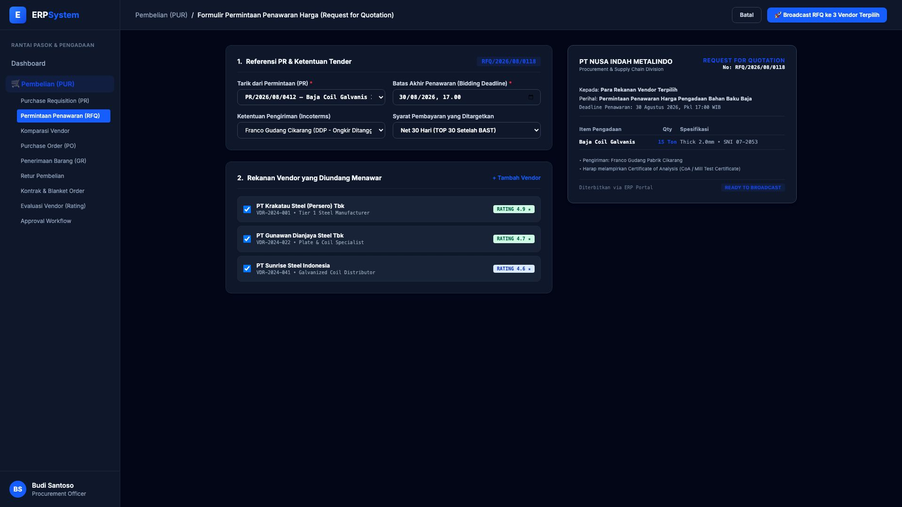

# 🎨 Design UI — Formulir Permintaan Penawaran Harga / RFQ (Data Entry Screen)

> Mockup antarmuka **Formulir Permintaan Penawaran Harga ke Vendor (Request for Quotation / RFQ Data Entry)**: desain *Split-Screen Form* dengan formulir input tender RFQ di sebelah kiri (Referensi PR, batas akhir penawaran bidding, Incoterms Franco Cikarang, TOP Net 30, checklist vendor target) dan *Live Pratinjau Lembar Dokumen Resmi RFQ & Status Broadcast* di sebelah kanan pada modul `PUR` (Pembelian / Purchasing) dalam ERP System.

---

## Light Mode

---

## Dark Mode

---

## 📝 Komponen & Fitur Formulir Input

1. **Panel Kiri — Formulir Perekaman RFQ**:
   - Nomor RFQ Otomatis: `RFQ/2026/08/0118`.
   - Asal Permintaan: `PR/2026/08/0412 — Baja Coil Galvanis 15 Ton`.
   - Bidding Deadline: *30 Agustus 2026, 17:00 WIB*.
   - Target Vendor: PT Krakatau Steel (4.9 ★), PT Gunawan Dianjaya Steel (4.7 ★), PT Sunrise Steel (4.6 ★).

2. **Panel Kanan — Pratinjau Dokumen RFQ Resmi**:
   - Format standar Divisi Procurement PT Nusa Indah Metalindo.
   - Status Kesiapan: 🟢 **READY TO BROADCAST** (Pengiriman otomatis via Portal Vendor & Notifikasi Email).
