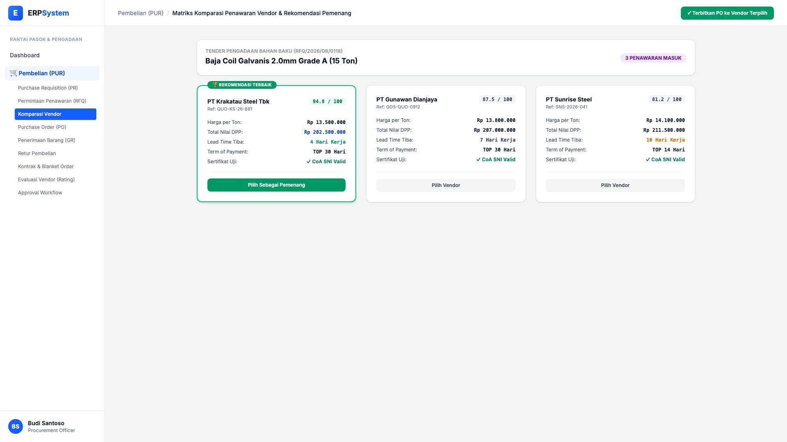
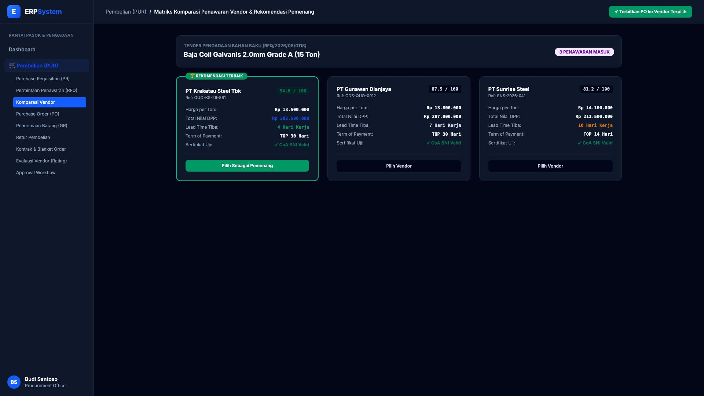

# 🎨 Design UI — Matriks Komparasi Penawaran Vendor (Vendor Comparison)

> Mockup antarmuka **Matriks Komparasi Penawaran Vendor & Pemilihan Pemenang Tender (Vendor Quotation Comparison Matrix)**: komparasi komprehensif harga per unit, total nilai DPP, lead time pengiriman, termin pembayaran TOP, ketersediaan Certificate of Analysis (CoA), dan scoring pembobotan otomatis pemenang tender pada modul `PUR` (Pembelian / Purchasing) dalam ERP System.

---

## Light Mode

---

## Dark Mode

---

## 📝 Komponen & Fitur Utama

1. **Hasil Evaluasi Komparasi Vendor Tender Baja Coil 15 Ton**:
   - 🏆 **PT Krakatau Steel Tbk (Skor 94.8 / 100 — REKOMENDASI TERBAIK)**:
     - Harga Satuan: Rp 13.500.000 / Ton &bull; Total: Rp 202.500.000.
     - Lead Time: 4 Hari Kerja &bull; TOP: Net 30 &bull; CoA SNI Valid.
   - **PT Gunawan Dianjaya (Skor 87.5 / 100)**:
     - Harga Satuan: Rp 13.800.000 / Ton &bull; Total: Rp 207.000.000.
     - Lead Time: 7 Hari Kerja &bull; TOP: Net 30 &bull; CoA SNI Valid.
   - **PT Sunrise Steel (Skor 81.2 / 100)**:
     - Harga Satuan: Rp 14.100.000 / Ton &bull; Total: Rp 211.500.000.
     - Lead Time: 10 Hari Kerja &bull; TOP: Net 14 &bull; CoA SNI Valid.
