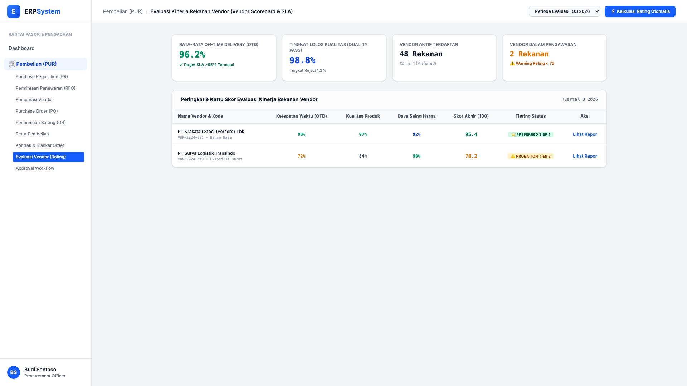
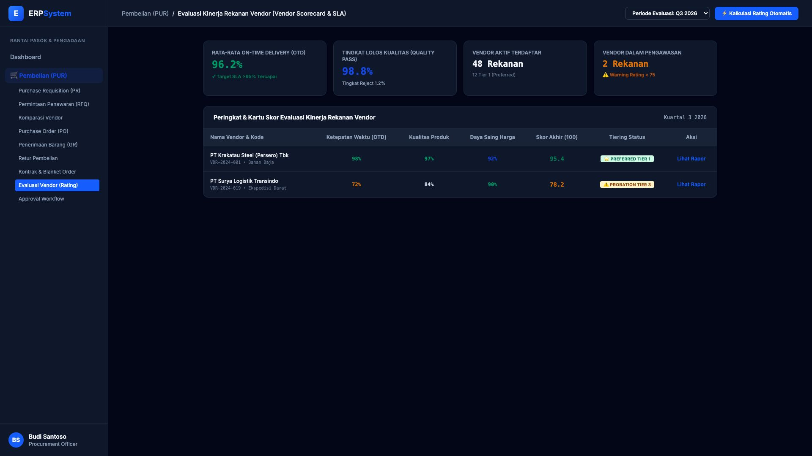

# 🎨 Design UI — Evaluasi Kinerja Vendor / Vendor Rating (Scorecard)

> Mockup antarmuka **Evaluasi Kinerja Rekanan Vendor (Vendor Scorecard & SLA Rating)**: kartu skor penilaian kuartalan, analisis persentase On-Time Delivery (OTD), tingkat penerimaan kualitas lolos QC (Quality Pass Rate), penentuan tingkatan vendor (Tier 1 Preferred / Tier 3 Probation), dan audit kepatuhan rekanan pengadaan pada modul `PUR` (Pembelian / Purchasing) dalam ERP System.

---

## Light Mode

---

## Dark Mode

---

## 📝 Komponen & Fitur Utama

1. **Ringkasan KPI Kinerja Pengadaan (Q3 2026)**:
   - **Rata-rata OTD Nasional**: 96.2% (🟢 Target SLA &gt;95% Terpenuhi).
   - **Quality Pass Rate**: 98.8% (Tingkat cacat/reject 1.2%).
   - **Total Vendor Aktif**: 48 Rekanan Terdaftar (12 Preferred Tier 1, 2 Probation).

2. **Tabel Evaluasi & Peringkat Vendor**:
   - ⭐ **PT Krakatau Steel (Persero) Tbk (Skor 95.4 / 100)**: OTD 98%, Kualitas 97%, Harga 92% &rarr; **PREFERRED TIER 1**.
   - ⚠️ **PT Surya Logistik Transindo (Skor 78.2 / 100)**: OTD 72%, Kualitas 84%, Harga 90% &rarr; **PROBATION TIER 3**.
