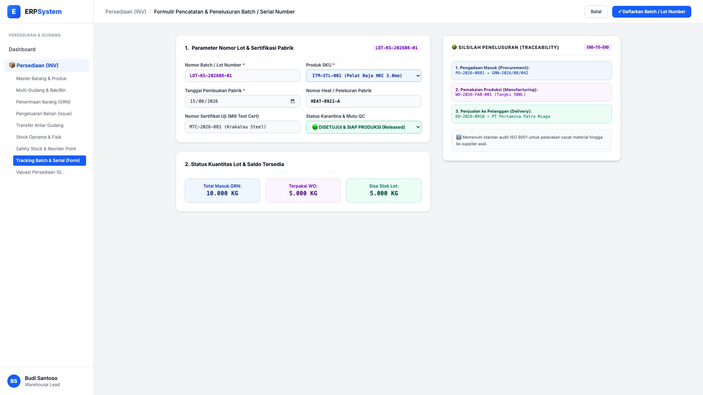
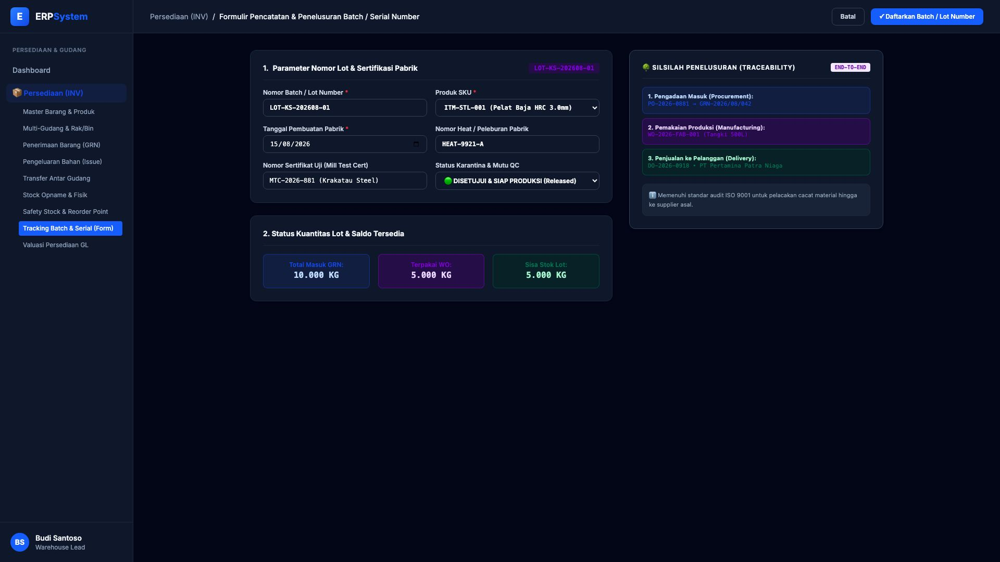

# 🎨 Design UI — Formulir Pencatatan & Penelusuran Batch / Serial Number (Data Entry Screen)

> Mockup antarmuka **Formulir Pencatatan & Penelusuran Batch / Lot & Serial Number (Batch & Serial Tracking Data Entry)**: desain *Split-Screen Form* dengan formulir input batch/lot di sebelah kiri (Nomor batch `LOT-KS-202608-01`, SKU Pelat Baja `ITM-STL-001`, tanggal produksi 15/08/2026, nomor heat peleburan `HEAT-9921-A`, nomor Mill Test Certificate `MTC-2026-881`, status lolos QC, status kuantitas: total 10.000 KG, terpakai 5.000 KG, sisa 5.000 KG) dan *Live Pohon Silsilah Penelusuran (End-to-End Traceability: PO &rarr; GRN &rarr; WO Produksi &rarr; Pelanggan DO)* di sebelah kanan pada modul `INV` (Persediaan & Gudang / Inventory) dalam ERP System.

---

## Light Mode

---

## Dark Mode

---

## 📝 Komponen & Fitur Formulir Input

1. **Panel Kiri — Formulir Parameter Lot & Sertifikat Uji**:
   - Nomor Lot: `LOT-KS-202608-01` &bull; Heat Number: `HEAT-9921-A`.
   - Sertifikat Pabrik: `MTC-2026-881 (Mill Test Certificate PT Krakatau Steel)`.
   - Status Mutu: **🟢 DISETUJUI & SIAP PRODUKSI (Released)**.
   - Posisi Kuantitas Lot: Masuk 10.000 KG &bull; Terpakai 5.000 KG &bull; **Sisa Stok: 5.000 KG**.

2. **Panel Kanan — Silsilah Penelusuran (Traceability Tree)**:
   - Pelacakan End-to-End: `PO-2026-0881` &rarr; `GRN-2026/08/042` &rarr; `WO-2026-FAB-001 (Tangki 500L)` &rarr; `DO-2026-0918 (PT Pertamina Patra Niaga)`.
   - Kepatuhan Standar Mutu Industri ISO 9001 / API Q1.
