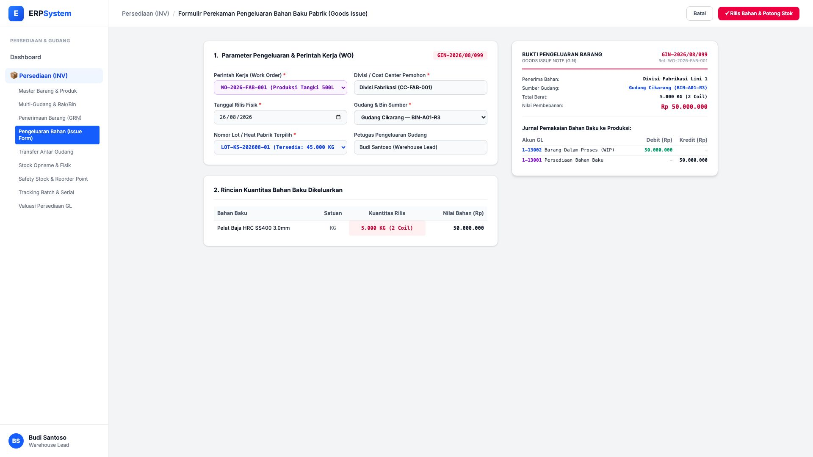
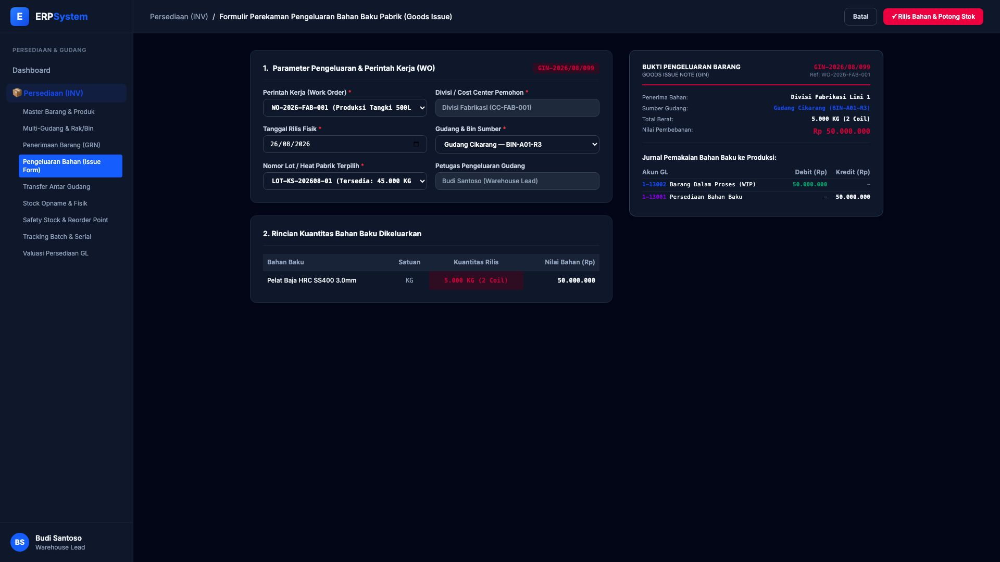

# 🎨 Design UI — Formulir Pengeluaran Bahan Baku Pabrik (Data Entry Screen)

> Mockup antarmuka **Formulir Perekaman Pengeluaran Bahan Baku Pabrik / Goods Issue (Inventory Goods Issue Data Entry)**: desain *Split-Screen Form* dengan formulir input pengeluaran bahan di sebelah kiri (Referensi Perintah Kerja `WO-2026-FAB-001`, divisi pemohon Fabrikasi, tanggal rilis 26/08/2026, gudang asal Cikarang Rak BIN-A01-R3, pemilihan lot number `LOT-KS-202608-01`, kuantitas rilis 5.000 KG / 2 Coil senilai Rp 50 Jt) dan *Live Dokumen Bukti Pengeluaran Barang (GIN Slip) & Jurnal Pembebanan Biaya Bahan Baku WIP ke GL* di sebelah kanan pada modul `INV` (Persediaan & Gudang / Inventory) dalam ERP System.

---

## Light Mode

---

## Dark Mode

---

## 📝 Komponen & Fitur Formulir Input

1. **Panel Kiri — Formulir Parameter Pengeluaran Bahan**:
   - Perintah Kerja (WO): `WO-2026-FAB-001 (Produksi Tangki 500L)`.
   - Divisi Pemohon: `Divisi Fabrikasi (CC-FAB-001)`.
   - Lokasi Asal: `Gudang Cikarang — BIN-A01-R3`.
   - Lot Number: `LOT-KS-202608-01` &bull; Kuantitas Rilis: **5.000 KG (2 Coil) = Rp 50.000.000**.

2. **Panel Kanan — Dokumen GIN & Jurnal Pembebanan WIP GL**:
   - Dokumen Pengeluaran Resmi: `GIN-2026/08/099`.
   - Jurnal Otomatis Pemakaian Bahan: Debit `1-13002 Barang Dalam Proses (WIP)` (Rp 50.000.000) vs Kredit `1-13001 Persediaan Bahan Baku` (Rp 50.000.000).
