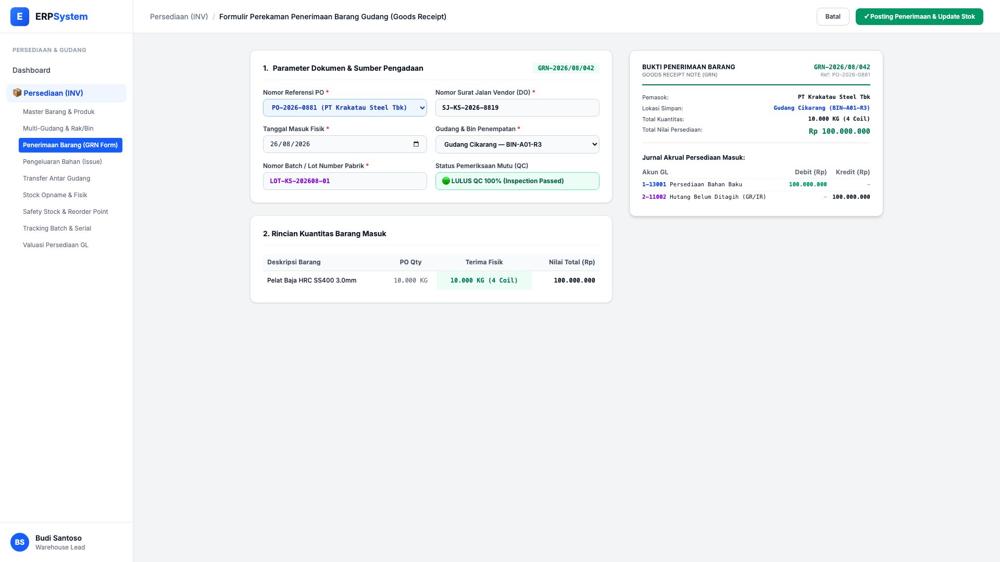
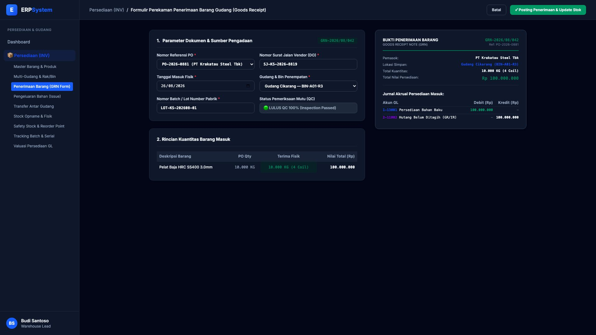

# 🎨 Design UI — Formulir Penerimaan Barang Gudang (Data Entry Screen)

> Mockup antarmuka **Formulir Perekaman Penerimaan Barang Gudang / Goods Receipt (Inventory Goods Receipt Data Entry)**: desain *Split-Screen Form* dengan formulir input penerimaan di sebelah kiri (Nomor PO `PO-2026-0881`, nomor surat jalan vendor `SJ-KS-2026-8819`, tanggal terima 26/08/2026, lokasi Gudang Cikarang Rak BIN-A01-R3, batch number `LOT-KS-202608-01`, verifikasi QC LULUS 100%, kuantitas fisik 10.000 KG / 4 Coil senilai Rp 100 Jt) dan *Live Dokumen Bukti Penerimaan Barang (GRN Slip) & Jurnal Akrual Persediaan GL* di sebelah kanan pada modul `INV` (Persediaan & Gudang / Inventory) dalam ERP System.

---

## Light Mode

---

## Dark Mode

---

## 📝 Komponen & Fitur Formulir Input

1. **Panel Kiri — Formulir Parameter Penerimaan & Mutu**:
   - Nomor Referensi: `PO-2026-0881` &bull; Surat Jalan: `SJ-KS-2026-8819`.
   - Lokasi Simpan: `Gudang Cikarang — BIN-A01-R3`.
   - Tracking Lot: `LOT-KS-202608-01` &bull; Mutu QC: **🟢 LULUS QC 100%**.
   - Kuantitas Terima: **10.000 KG (4 Coil) @ Rp 10.000/Kg = Rp 100.000.000**.

2. **Panel Kanan — Dokumen GRN & Jurnal Persediaan Masuk**:
   - Dokumen Penerimaan Resmi: `GRN-2026/08/042`.
   - Jurnal Akrual Otomatis: Debit `1-13001 Persediaan Bahan Baku` (Rp 100.000.000) vs Kredit `2-11002 Hutang Belum Ditagih / GR/IR Clearing` (Rp 100.000.000).
