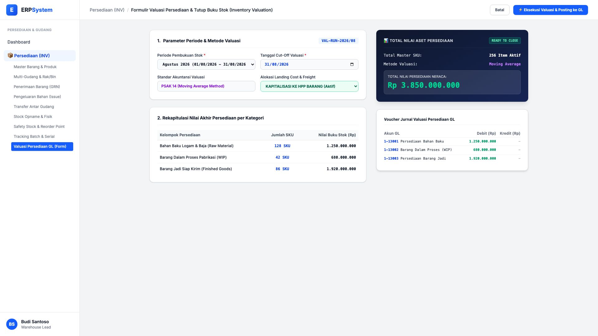
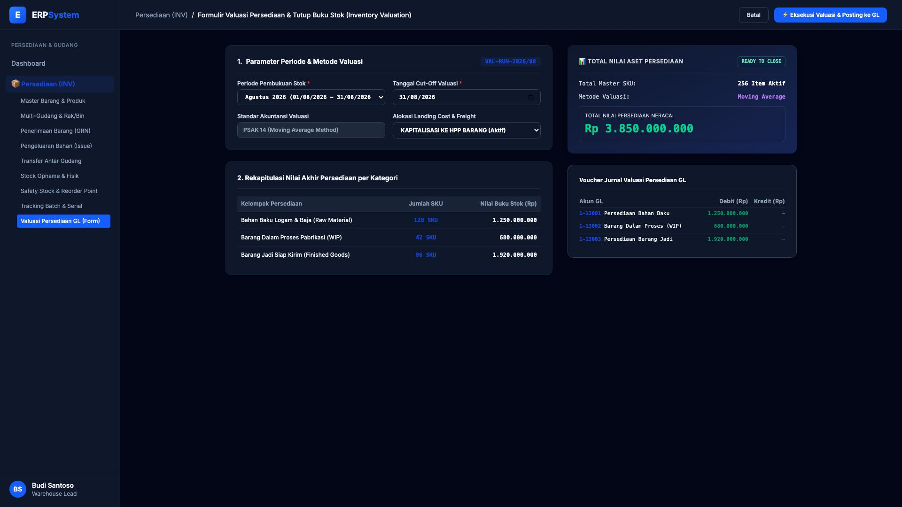

# 🎨 Design UI — Formulir Valuasi Persediaan & Tutup Buku Stok (Data Entry Screen)

> Mockup antarmuka **Formulir Valuasi Persediaan & Penutupan Nilai Stok Bulanan (Inventory Valuation & Stock Closing Data Entry)**: desain *Split-Screen Form* dengan formulir input periode valuasi di sebelah kiri (Periode Agustus 2026, cut-off 31/08/2026, PSAK 14 Moving Average, alokasi landing cost dan freight ke HPP, rincian buku: Bahan Baku Rp 1,25 M / 128 SKU, WIP Rp 680 Jt / 42 SKU, Finished Goods Rp 1,92 M / 86 SKU) dan *Live Ringkasan Total Nilai Persediaan Neraca (Rp 3.850.000.000) & Voucher Jurnal Valuasi Persediaan GL* di sebelah kanan pada modul `INV` (Persediaan & Gudang / Inventory) dalam ERP System.

---

## Light Mode

---

## Dark Mode

---

## 📝 Komponen & Fitur Formulir Input

1. **Panel Kiri — Formulir Parameter Periode & Kelompok Persediaan**:
   - Periode: `Agustus 2026` &bull; Tanggal Cut-Off: **31/08/2026**.
   - Metode: **PSAK 14 (Moving Average Method)**.
   - Freight / Landing Cost: **Kapitalisasi ke Nilai Masuk Barang (Aktif)**.
   - Rincian Saldo Akhir:
     - Bahan Baku (*Raw Material*): **Rp 1.250.000.000 (128 SKU)**
     - Barang Dalam Proses (*WIP*): **Rp 680.000.000 (42 SKU)**
     - Barang Jadi (*Finished Goods*): **Rp 1.920.000.000 (86 SKU)**

2. **Panel Kanan — Ringkasan Neraca & Jurnal Valuasi GL**:
   - Total Nilai Aset Persediaan: **Rp 3.850.000.000 (256 SKU Aktif)**.
   - Jurnal Posting Neraca GL:
     - Debit `1-13001 Persediaan Bahan Baku`: Rp 1.250.000.000
     - Debit `1-13002 Barang Dalam Proses (WIP)`: Rp 680.000.000
     - Debit `1-13003 Persediaan Barang Jadi`: Rp 1.920.000.000
