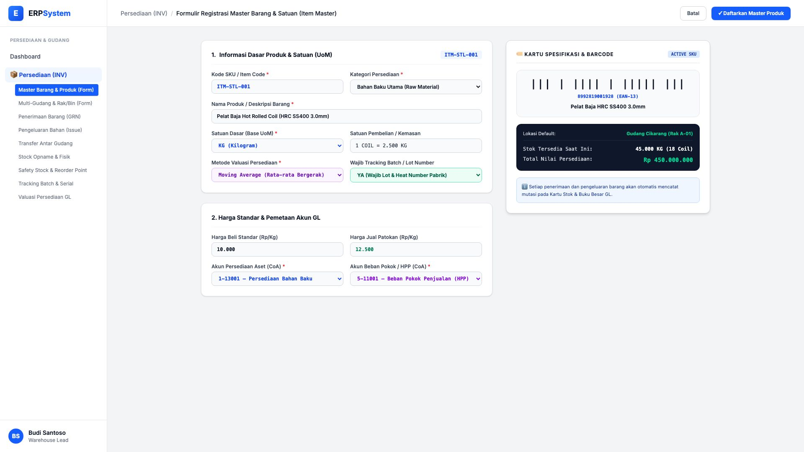
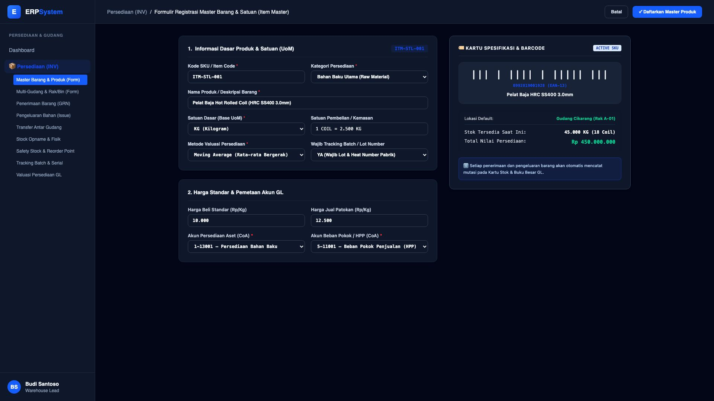

# 🎨 Design UI — Formulir Master Barang & Produk (Data Entry Screen)

> Mockup antarmuka **Formulir Registrasi Master Barang & Satuan / Item Master (Inventory Master Data Entry)**: desain *Split-Screen Form* dengan formulir input master produk di sebelah kiri (Kode SKU `ITM-STL-001`, kategori Bahan Baku, nama produk Pelat Baja HRC SS400 3.0mm, satuan dasar KG, konversi 1 Coil = 2.500 KG, metode valuasi Moving Average, wajib tracking lot/batch, harga beli Rp 10.000/Kg, akun GL persediaan & HPP) dan *Live Pratinjau Kartu Spesifikasi Produk & Barcode EAN-13, Lokasi Default Rak A-01, Saldo Stok (45.000 KG / Rp 450 Jt)* di sebelah kanan pada modul `INV` (Persediaan & Gudang / Inventory) dalam ERP System.

---

## Light Mode

---

## Dark Mode

---

## 📝 Komponen & Fitur Formulir Input

1. **Panel Kiri — Formulir Parameter Master Barang & Satuan**:
   - Kode SKU: `ITM-STL-001` &bull; Kategori: **Bahan Baku Utama (Raw Material)**.
   - Nama Produk: *Pelat Baja Hot Rolled Coil (HRC SS400 3.0mm)*.
   - Satuan: **KG (Base UoM)** &bull; Kemasan: **1 COIL = 2.500 KG**.
   - Valuasi: **Moving Average (Rata-rata Bergerak)** &bull; Tracking: **Batch / Heat Number Wajib**.
   - Pemetaan Akun GL: `1-13001 Persediaan Bahan Baku` & `5-11001 Beban Pokok Penjualan (HPP)`.

2. **Panel Kanan — Kartu Spesifikasi & Status Persediaan**:
   - Barcode Scanner Ready: `8992819001928 (EAN-13)`.
   - Lokasi Default Simpan: *Gudang Cikarang (Rak A-01)*.
   - Stok Tersedia Eksisting: **45.000 KG (18 Coil)** &bull; **Total Nilai: Rp 450.000.000**.
