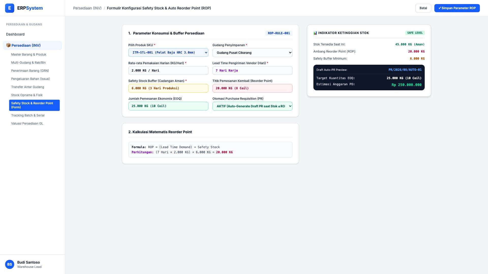
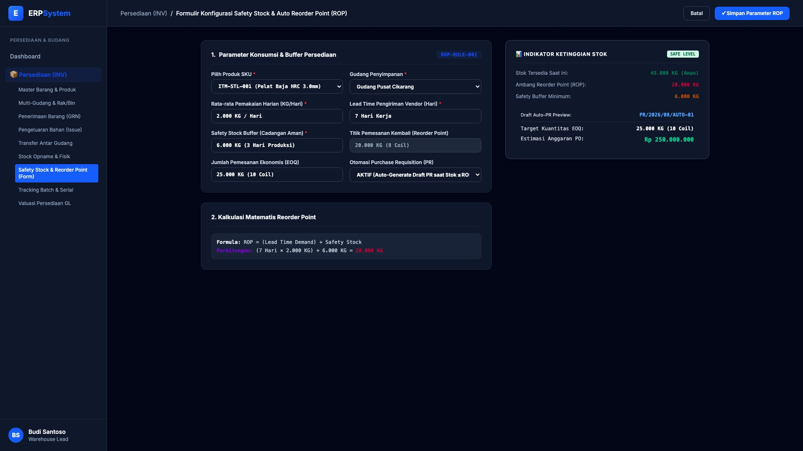

# 🎨 Design UI — Formulir Safety Stock & Auto Reorder Point (Data Entry Screen)

> Mockup antarmuka **Formulir Konfigurasi Safety Stock & Auto Reorder Point (Inventory Replenishment & ROP Data Entry)**: desain *Split-Screen Form* dengan formulir input parameter pengadaan otomatis di sebelah kiri (Pemakaian harian 2.000 KG/hari, lead time vendor 7 hari, cadangan aman safety stock 6.000 KG, kalkulasi titik pemesanan kembali ROP = 20.000 KG, kuantitas ekonomis EOQ = 25.000 KG / 10 Coil, aktivasi auto-generate PR) dan *Live Indikator Ketinggian Stok (Tersedia 45.000 KG / Aman) & Pratinjau Draft Purchase Requisition Otomatis `PR/2026/08/AUTO-01` (Rp 250.000.000)* di sebelah kanan pada modul `INV` (Persediaan & Gudang / Inventory) dalam ERP System.

---

## Light Mode

---

## Dark Mode

---

## 📝 Komponen & Fitur Formulir Input

1. **Panel Kiri — Formulir Parameter Konsumsi & Reorder Formula**:
   - Produk SKU: `ITM-STL-001 (Pelat Baja HRC 3.0mm)`.
   - Pemakaian Rata-rata: **2.000 KG / Hari** &bull; Lead Time: **7 Hari Kerja**.
   - Safety Stock Buffer: **6.000 KG (3 Hari Buffer)**.
   - Titik Pemesanan Kembali (*ROP*): **(7 &times; 2.000) + 6.000 = 20.000 KG**.
   - Jumlah Pemesanan Ekonomis (*EOQ*): **25.000 KG (10 Coil)** &bull; Otomasi PR: **AKTIF**.

2. **Panel Kanan — Indikator Stok & Draft Auto-PR**:
   - Status Ketinggian Stok: **45.000 KG (🟢 Safe Level)**.
   - Ambang Reorder: **20.000 KG** &bull; Safety Buffer: **6.000 KG**.
   - Draft Auto-Generate PR: `PR/2026/08/AUTO-01` (Nilai Estimasi: **Rp 250.000.000**).
