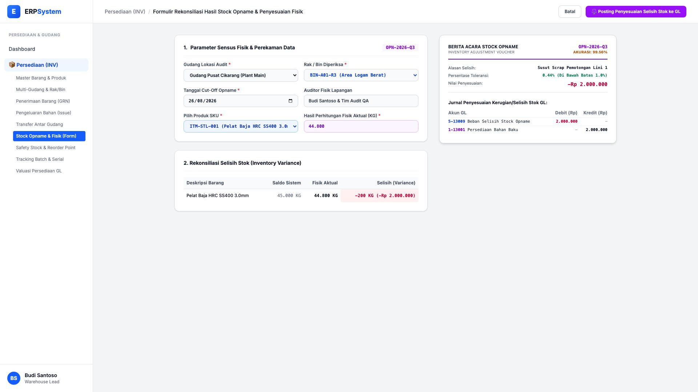
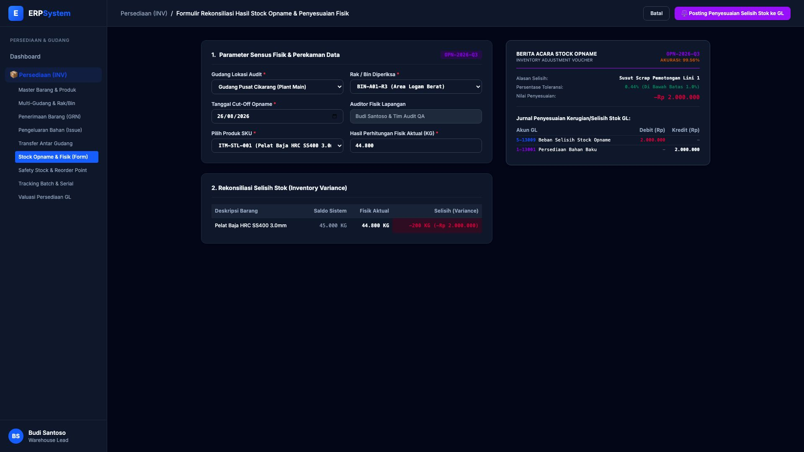

# 🎨 Design UI — Formulir Rekonsiliasi Stock Opname & Penyesuaian Fisik (Data Entry Screen)

> Mockup antarmuka **Formulir Rekonsiliasi Stock Opname & Penyesuaian Persediaan Fisik (Stock Opname & Inventory Adjustment Data Entry)**: desain *Split-Screen Form* dengan formulir input rekonsiliasi opname di sebelah kiri (Gudang Utama Cikarang Rak BIN-A01-R3, tanggal cut-off 26/08/2026, pencatatan SKU Pelat Baja `ITM-STL-001`, saldo sistem 45.000 KG vs fisik aktual 44.800 KG, selisih -200 KG / defisit 0.44%) dan *Live Berita Acara Rekonsiliasi Opname (Akurasi 99.56%) & Jurnal Penyesuaian Kerugian/Selisih Stok GL* di sebelah kanan pada modul `INV` (Persediaan & Gudang / Inventory) dalam ERP System.

---

## Light Mode

---

## Dark Mode

---

## 📝 Komponen & Fitur Formulir Input

1. **Panel Kiri — Formulir Sensus & Rekonsiliasi Fisik**:
   - Nomor Sensus: `OPN-2026-Q3` &bull; Lokasi: `Gudang Cikarang — BIN-A01-R3`.
   - SKU Diperiksa: `ITM-STL-001 (Pelat Baja HRC SS400 3.0mm)`.
   - Saldo Sistem: **45.000 KG** vs Fisik Aktual: **44.800 KG**.
   - Selisih (*Variance*): **-200 KG (-Rp 2.000.000)** karena susut scrap pemotongan.

2. **Panel Kanan — Berita Acara & Jurnal Penyesuaian GL**:
   - Berita Acara Stock Opname Resmi: **Tingkat Akurasi 99.56% (Passed)**.
   - Jurnal Selisih Otomatis: Debit `5-13009 Beban Selisih Stock Opname` (Rp 2.000.000) vs Kredit `1-13001 Persediaan Bahan Baku` (Rp 2.000.000).
