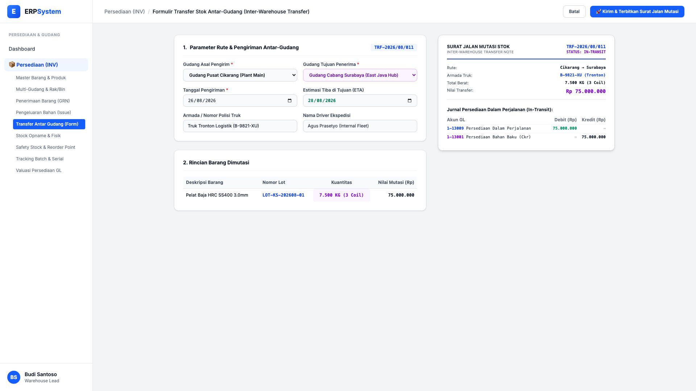
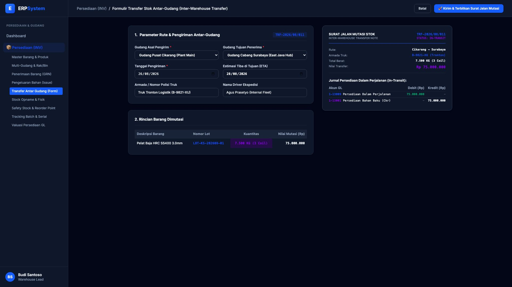

# 🎨 Design UI — Formulir Transfer Stok Antar-Gudang (Data Entry Screen)

> Mockup antarmuka **Formulir Perekaman Mutasi & Transfer Stok Antar-Gudang (Inter-Warehouse Stock Transfer Data Entry)**: desain *Split-Screen Form* dengan formulir input transfer stok di sebelah kiri (Gudang Asal Pusat Cikarang, Gudang Tujuan Cabang Surabaya, tanggal kirim 26/08/2026, armada truk tronton logistik B-9821-XU, nomor lot `LOT-KS-202608-01`, kuantitas transfer 7.500 KG / 3 Coil senilai Rp 75 Jt) dan *Live Dokumen Surat Jalan Mutasi Stok Resmi & Jurnal GL Persediaan Dalam Perjalanan (In-Transit)* di sebelah kanan pada modul `INV` (Persediaan & Gudang / Inventory) dalam ERP System.

---

## Light Mode

---

## Dark Mode

---

## 📝 Komponen & Fitur Formulir Input

1. **Panel Kiri — Formulir Parameter Rute & Pengiriman**:
   - Asal: `Gudang Pusat Cikarang` &rarr; Tujuan: `Gudang Cabang Surabaya`.
   - Jadwal: Kirim **26/08/2026** &bull; Estimasi Tiba (ETA): **28/08/2026**.
   - Armada: *Truk Tronton Logistik (B-9821-XU)* &bull; Driver: *Agus Prasetyo*.
   - Kuantitas Dimutasi: **7.500 KG (3 Coil) = Rp 75.000.000**.

2. **Panel Kanan — Surat Jalan Mutasi & Jurnal In-Transit**:
   - Surat Jalan Transfer: `TRF-2026/08/011 (STATUS: IN-TRANSIT)`.
   - Jurnal Akuntansi: Debit `1-13009 Persediaan Dalam Perjalanan` (Rp 75.000.000) vs Kredit `1-13001 Persediaan Bahan Baku Cikarang` (Rp 75.000.000).
