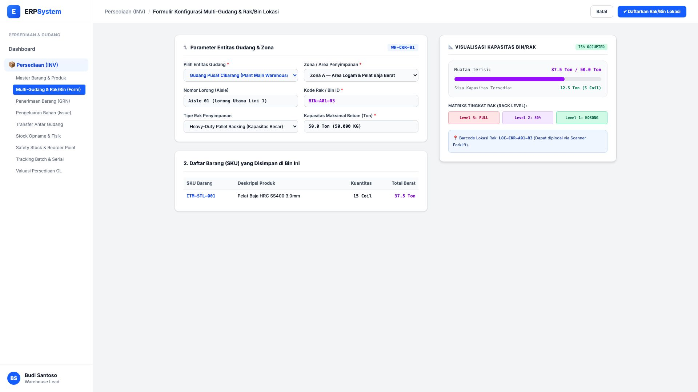
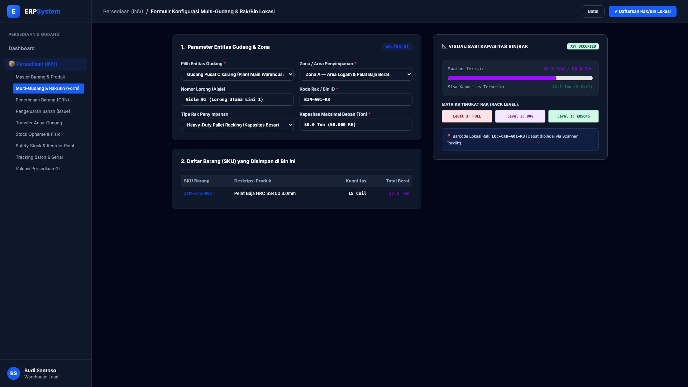

# 🎨 Design UI — Formulir Multi-Gudang & Lokasi Rak/Bin (Data Entry Screen)

> Mockup antarmuka **Formulir Konfigurasi Multi-Gudang & Lokasi Rak/Bin (Warehouse & Bin Location Data Entry)**: desain *Split-Screen Form* dengan formulir input lokasi gudang di sebelah kiri (Gudang Utama Cikarang, Zona A Logam Berat, Lorong Aisle 01, ID Rak `BIN-A01-R3`, tipe Heavy-Duty Pallet Racking, kapasitas maksimal 50 Ton) dan *Live Visualisasi Denah Kapasitas Rak (Terisi 37.5 Ton / 75%, Sisa 12.5 Ton) & Matriks Tingkat Rak (Rack Level 1, 2, 3)* di sebelah kanan pada modul `INV` (Persediaan & Gudang / Inventory) dalam ERP System.

---

## Light Mode

---

## Dark Mode

---

## 📝 Komponen & Fitur Formulir Input

1. **Panel Kiri — Formulir Parameter Gudang & Rak**:
   - Entitas: `Gudang Pusat Cikarang (Plant Main Warehouse)`.
   - Zona: `Zona A — Area Logam & Pelat Baja Berat` &bull; Lorong: `Aisle 01`.
   - Kode Rak/Bin: `BIN-A01-R3` &bull; Tipe: **Heavy-Duty Pallet Racking**.
   - Kapasitas Maksimal: **50.0 Ton (50.000 KG)**.

2. **Panel Kanan — Visualisasi Kapasitas & Matriks Rak**:
   - Muatan Terisi Saat Ini: **37.5 Ton (75% Occupied)**.
   - Sisa Kapasitas Tersedia: **12.5 Ton (5 Slot Coil Kosong)**.
   - Matriks Rak: Level 3 (FULL), Level 2 (80%), Level 1 (KOSONG).
   - Barcode Lokasi Scanner: `LOC-CKR-A01-R3`.
